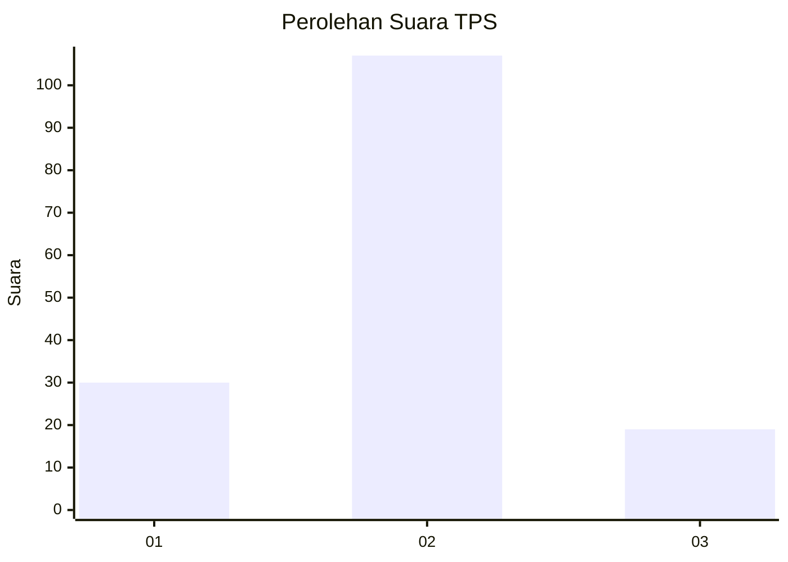
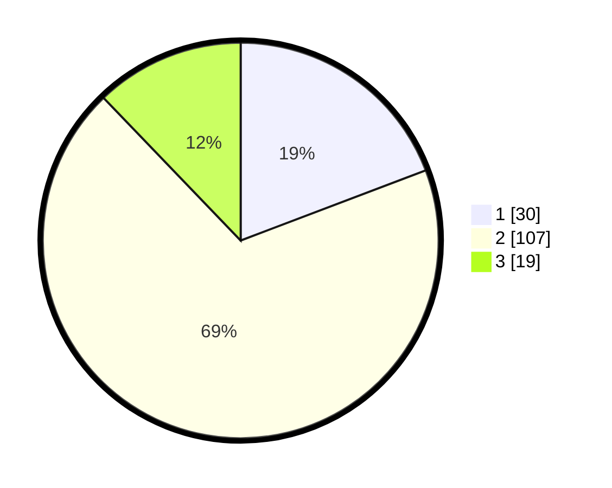

# Hasil

## Grafik

## Tabel

| No. | Nama Paslon    | Suara | Suara (raw) | Persentase |
|:--- |:-------------- | -----:| -----------:| ----------:|
| 1   | ANIES MUHAIMIN | 30    | [30][p-1]   | 19,23      |
| 2   | PRABOWO GIBRAN | 107   | [107][p-2]  | 68,59      |
| 3   | GANJAR MAHFUD  | 19    | [19][p-3]   | 12,18      |

[p-1]: https://github.com/gigit-pemilu/pemilu-2024-92-papua-barat/blob/main/pilpres/hitung-suara/sub/92-papua-barat/sub/03-fak-fak/sub/05-fak-fak-tengah/sub/1001-danaweria/sub/010-tps/sub/paslon-1.txt
[p-2]: https://github.com/gigit-pemilu/pemilu-2024-92-papua-barat/blob/main/pilpres/hitung-suara/sub/92-papua-barat/sub/03-fak-fak/sub/05-fak-fak-tengah/sub/1001-danaweria/sub/010-tps/sub/paslon-2.txt
[p-3]: https://github.com/gigit-pemilu/pemilu-2024-92-papua-barat/blob/main/pilpres/hitung-suara/sub/92-papua-barat/sub/03-fak-fak/sub/05-fak-fak-tengah/sub/1001-danaweria/sub/010-tps/sub/paslon-3.txt

## Foto C Plano

https://sirekap-obj-formc.kpu.go.id/786d/pemilu/ppwp/92/03/05/10/01/9203051001010-20240216-194740--d3eeebfb-cbc8-4e34-91dc-4f623c5cc9b2.jpg

https://sirekap-obj-formc.kpu.go.id/786d/pemilu/ppwp/92/03/05/10/01/9203051001010-20240216-194834--5ac09f07-74be-4277-a172-a789acfd0e79.jpg

https://sirekap-obj-formc.kpu.go.id/786d/pemilu/ppwp/92/03/05/10/01/9203051001010-20240216-194850--257c1521-8a6d-4839-b0a6-6c3b8e6a9997.jpg

## Metadata

| Key        | Value               |
| ---------- | ------------------- |
| Time Stamp | 2024-02-22 11:00:00 |

