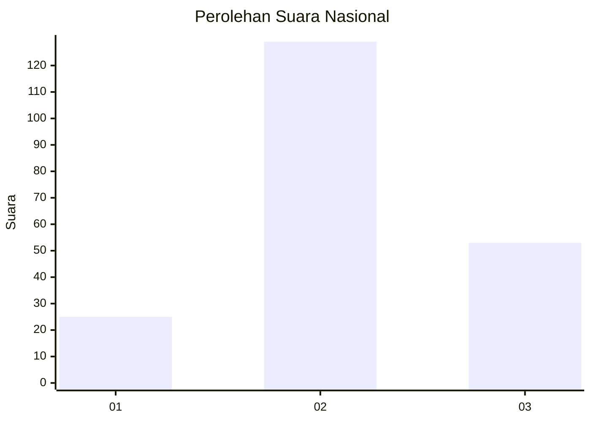
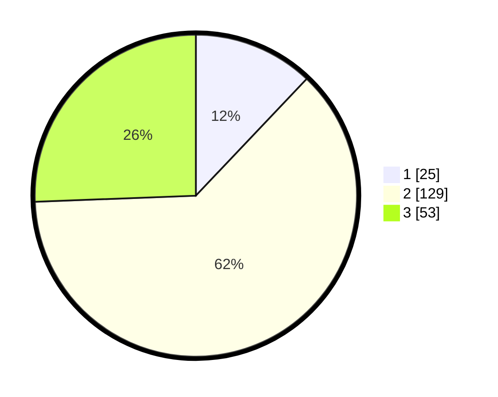

# Hasil

## Grafik

## Tabel

| No. | Nama Paslon    | Suara | Suara (raw) | Persentase |
|:--- |:-------------- | -----:| -----------:| ----------:|
| 1   | ANIES MUHAIMIN | 25    | [25][p-1]   | 12,08      |
| 2   | PRABOWO GIBRAN | 129   | [129][p-2]  | 62,32      |
| 3   | GANJAR MAHFUD  | 53    | [53][p-3]   | 25,60      |

[p-1]: https://github.com/gigit-pemilu/pemilu-2024/blob/main/pilpres/hitung-suara/sub/92-papua-barat/sub/03-fak-fak/sub/05-fak-fak-tengah/sub/1001-danaweria/sub/014-tps/sub/paslon-1.txt
[p-2]: https://github.com/gigit-pemilu/pemilu-2024/blob/main/pilpres/hitung-suara/sub/92-papua-barat/sub/03-fak-fak/sub/05-fak-fak-tengah/sub/1001-danaweria/sub/014-tps/sub/paslon-2.txt
[p-3]: https://github.com/gigit-pemilu/pemilu-2024/blob/main/pilpres/hitung-suara/sub/92-papua-barat/sub/03-fak-fak/sub/05-fak-fak-tengah/sub/1001-danaweria/sub/014-tps/sub/paslon-3.txt

## Foto C Plano

https://sirekap-obj-formc.kpu.go.id/59d4/pemilu/ppwp/92/03/05/10/01/9203051001014-20240215-124602--9a82dc93-8aa7-429f-bc12-818a3ed2dedc.jpg

https://sirekap-obj-formc.kpu.go.id/59d4/pemilu/ppwp/92/03/05/10/01/9203051001014-20240215-125029--54b42060-ec92-41b8-98f7-7497aa219d88.jpg

https://sirekap-obj-formc.kpu.go.id/59d4/pemilu/ppwp/92/03/05/10/01/9203051001014-20240215-124804--b6d3cb3d-56e0-4804-9859-da8f2e1144e2.jpg

## Metadata

| Key        | Value               |
| ---------- | ------------------- |
| Time Stamp | 2024-02-15 23:29:50 |

