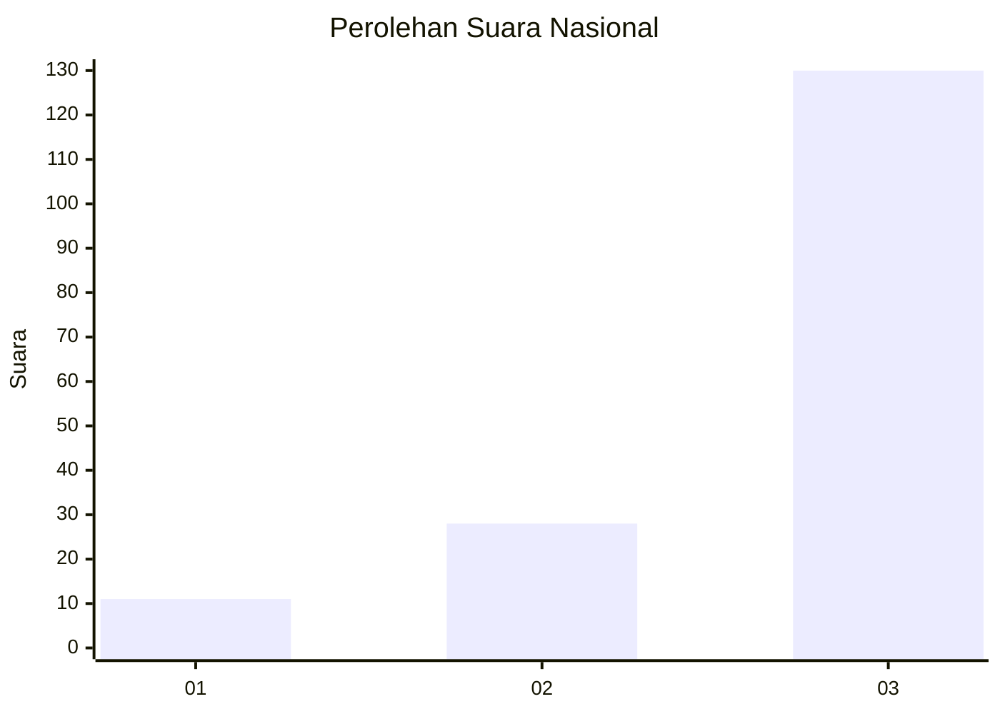
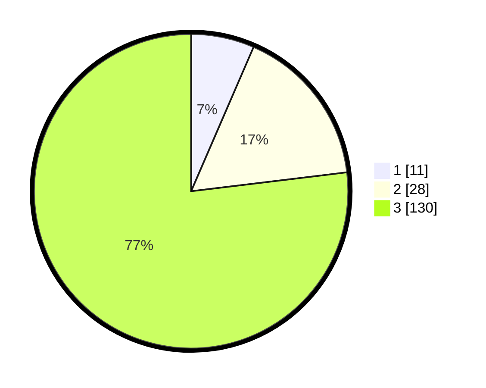

# Hasil

## Grafik

## Tabel

| No. | Nama Paslon    | Suara | Suara (raw) | Persentase |
|:--- |:-------------- | -----:| -----------:| ----------:|
| 1   | ANIES MUHAIMIN | 11    | [11][p-1]   | 6,51       |
| 2   | PRABOWO GIBRAN | 28    | [28][p-2]   | 16,57      |
| 3   | GANJAR MAHFUD  | 130   | [130][p-3]  | 76,92      |

[p-1]: https://github.com/gigit-pemilu/pemilu-2024/blob/main/pilpres/hitung-suara/sub/92-papua-barat/sub/03-fak-fak/sub/05-fak-fak-tengah/sub/2013-hambrangkendik/sub/001-tps/sub/paslon-1.txt
[p-2]: https://github.com/gigit-pemilu/pemilu-2024/blob/main/pilpres/hitung-suara/sub/92-papua-barat/sub/03-fak-fak/sub/05-fak-fak-tengah/sub/2013-hambrangkendik/sub/001-tps/sub/paslon-2.txt
[p-3]: https://github.com/gigit-pemilu/pemilu-2024/blob/main/pilpres/hitung-suara/sub/92-papua-barat/sub/03-fak-fak/sub/05-fak-fak-tengah/sub/2013-hambrangkendik/sub/001-tps/sub/paslon-3.txt

## Foto C Plano

https://sirekap-obj-formc.kpu.go.id/53c1/pemilu/ppwp/92/03/05/20/13/9203052013001-20240215-123507--dc94d941-746b-4034-a417-ce1851e2017a.jpg

https://sirekap-obj-formc.kpu.go.id/53c1/pemilu/ppwp/92/03/05/20/13/9203052013001-20240215-123525--8aa6f793-8767-4e6a-be1e-ace17a9ff023.jpg

https://sirekap-obj-formc.kpu.go.id/53c1/pemilu/ppwp/92/03/05/20/13/9203052013001-20240215-123210--9f94653b-e59f-4165-8248-9d402cc22475.jpg

## Metadata

| Key        | Value               |
| ---------- | ------------------- |
| Time Stamp | 2024-02-24 22:31:28 |

