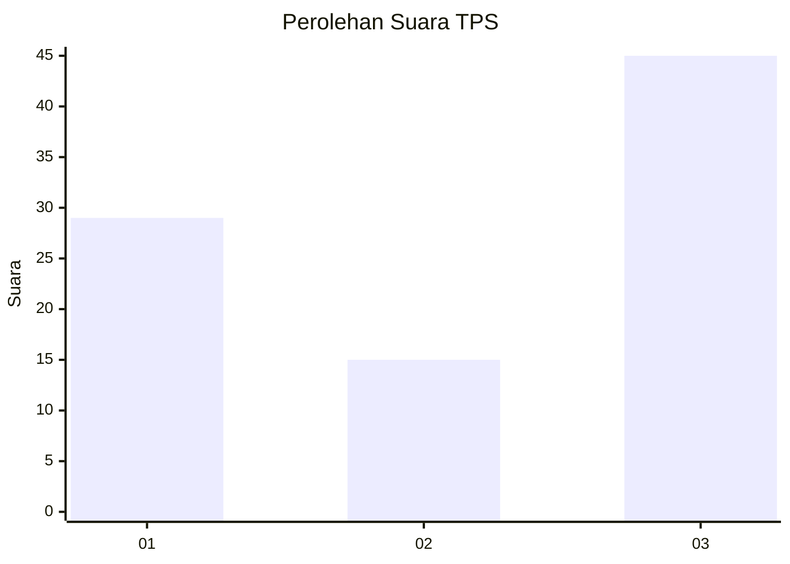
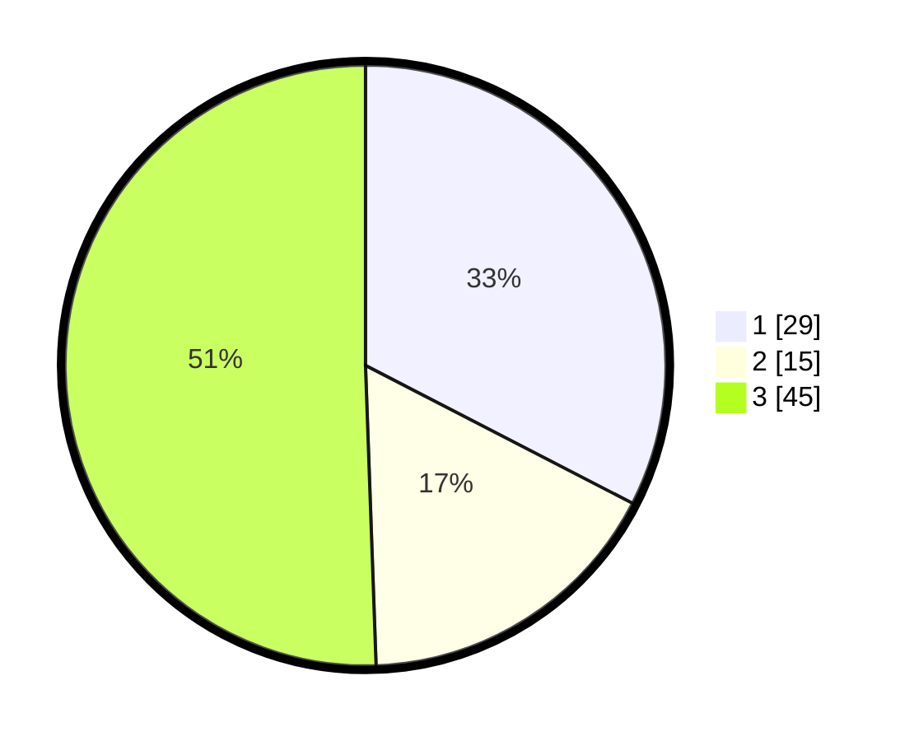

# Hasil

## Grafik

## Tabel

| No. | Nama Paslon    | Suara | Suara (raw) | Persentase |
|:--- |:-------------- | -----:| -----------:| ----------:|
| 1   | ANIES MUHAIMIN | 29    | [29][p-1]   | 32,58      |
| 2   | PRABOWO GIBRAN | 15    | [15][p-2]   | 16,85      |
| 3   | GANJAR MAHFUD  | 45    | [45][p-3]   | 50,56      |

[p-1]: https://github.com/gigit-pemilu/pemilu-2024-92-papua-barat/blob/main/pilpres/hitung-suara/sub/92-papua-barat/sub/03-fak-fak/sub/08-kramongmongga/sub/2009-nembukteb/sub/001-tps/sub/paslon-1.txt
[p-2]: https://github.com/gigit-pemilu/pemilu-2024-92-papua-barat/blob/main/pilpres/hitung-suara/sub/92-papua-barat/sub/03-fak-fak/sub/08-kramongmongga/sub/2009-nembukteb/sub/001-tps/sub/paslon-2.txt
[p-3]: https://github.com/gigit-pemilu/pemilu-2024-92-papua-barat/blob/main/pilpres/hitung-suara/sub/92-papua-barat/sub/03-fak-fak/sub/08-kramongmongga/sub/2009-nembukteb/sub/001-tps/sub/paslon-3.txt

## Foto C Plano

https://sirekap-obj-formc.kpu.go.id/d732/pemilu/ppwp/92/03/08/20/09/9203082009001-20240215-151011--c21beec6-aa1a-4234-b4c1-630bc602643d.jpg

https://sirekap-obj-formc.kpu.go.id/d732/pemilu/ppwp/92/03/08/20/09/9203082009001-20240215-162902--c44f0606-0367-449a-bcf1-d47694402041.jpg

https://sirekap-obj-formc.kpu.go.id/d732/pemilu/ppwp/92/03/08/20/09/9203082009001-20240215-153410--d9c2ab68-14a9-4194-a5bb-e38c6e6c19c9.jpg

## Metadata

| Key        | Value               |
| ---------- | ------------------- |
| Time Stamp | 2024-02-25 12:00:00 |

