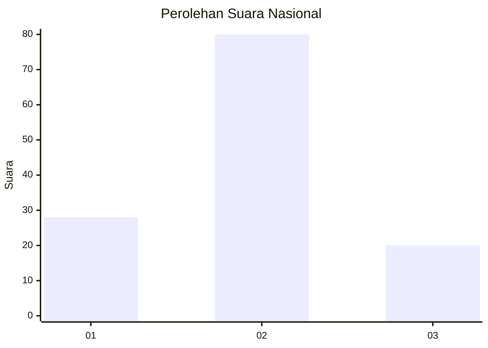
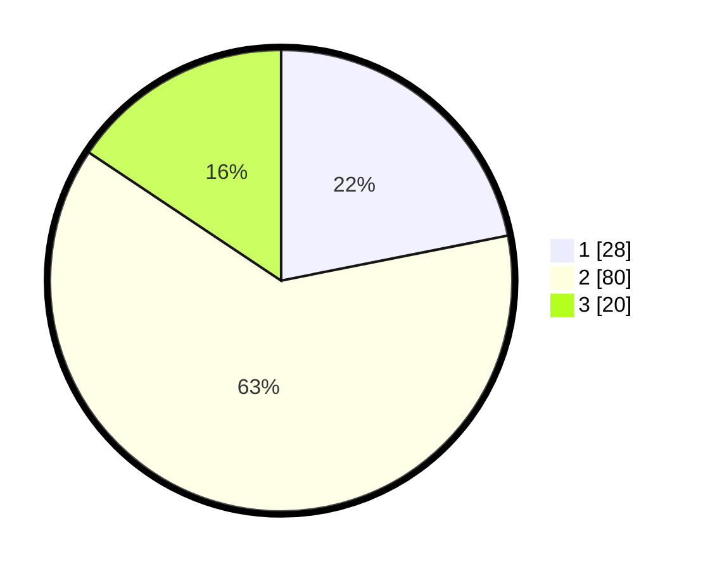

# Hasil

## Grafik

## Tabel

| No. | Nama Paslon    | Suara | Suara (raw) | Persentase |
|:--- |:-------------- | -----:| -----------:| ----------:|
| 1   | ANIES MUHAIMIN | 28    | [28][p-1]   | 21,88      |
| 2   | PRABOWO GIBRAN | 80    | [80][p-2]   | 62,50      |
| 3   | GANJAR MAHFUD  | 20    | [20][p-3]   | 15,63      |

[p-1]: https://github.com/gigit-pemilu/pemilu-2024/blob/main/pilpres/hitung-suara/sub/92-papua-barat/sub/03-fak-fak/sub/10-pariwari/sub/1001-wagom/sub/006-tps/sub/paslon-1.txt
[p-2]: https://github.com/gigit-pemilu/pemilu-2024/blob/main/pilpres/hitung-suara/sub/92-papua-barat/sub/03-fak-fak/sub/10-pariwari/sub/1001-wagom/sub/006-tps/sub/paslon-2.txt
[p-3]: https://github.com/gigit-pemilu/pemilu-2024/blob/main/pilpres/hitung-suara/sub/92-papua-barat/sub/03-fak-fak/sub/10-pariwari/sub/1001-wagom/sub/006-tps/sub/paslon-3.txt

## Foto C Plano

https://sirekap-obj-formc.kpu.go.id/a661/pemilu/ppwp/92/03/10/10/01/9203101001006-20240215-061751--f2bacb1a-d1ba-4d86-aaa8-91ededee6d04.jpg

https://sirekap-obj-formc.kpu.go.id/a661/pemilu/ppwp/92/03/10/10/01/9203101001006-20240215-062023--cf9f8972-08f8-474d-bae5-9ade096ca240.jpg

https://sirekap-obj-formc.kpu.go.id/a661/pemilu/ppwp/92/03/10/10/01/9203101001006-20240215-062202--f6cc82a7-cfb0-4a08-8196-0c5e719ede3c.jpg

## Metadata

| Key        | Value               |
| ---------- | ------------------- |
| Time Stamp | 2024-02-25 15:00:00 |

