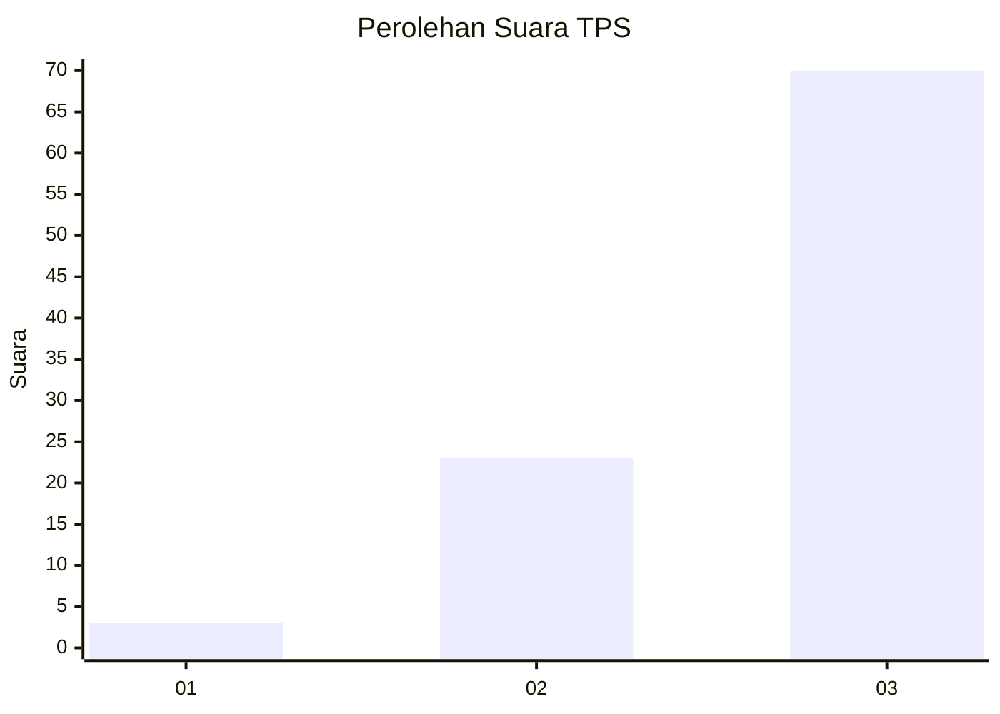
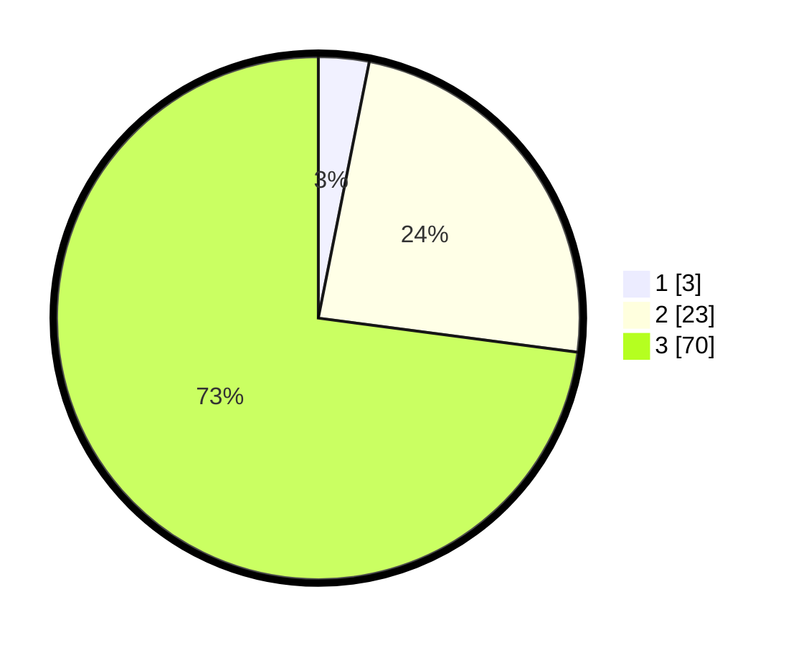

# Hasil

## Grafik

## Tabel

| No. | Nama Paslon    | Suara | Suara (raw) | Persentase |
|:--- |:-------------- | -----:| -----------:| ----------:|
| 1   | ANIES MUHAIMIN | 3     | [3][p-1]    | 3,13       |
| 2   | PRABOWO GIBRAN | 23    | [23][p-2]   | 23,96      |
| 3   | GANJAR MAHFUD  | 70    | [70][p-3]   | 72,92      |

[p-1]: https://github.com/gigit-pemilu/pemilu-2024-92-papua-barat/blob/main/pilpres/hitung-suara/sub/92-papua-barat/sub/03-fak-fak/sub/11-wartutin/sub/2003-wartutin/sub/001-tps/sub/paslon-1.txt
[p-2]: https://github.com/gigit-pemilu/pemilu-2024-92-papua-barat/blob/main/pilpres/hitung-suara/sub/92-papua-barat/sub/03-fak-fak/sub/11-wartutin/sub/2003-wartutin/sub/001-tps/sub/paslon-2.txt
[p-3]: https://github.com/gigit-pemilu/pemilu-2024-92-papua-barat/blob/main/pilpres/hitung-suara/sub/92-papua-barat/sub/03-fak-fak/sub/11-wartutin/sub/2003-wartutin/sub/001-tps/sub/paslon-3.txt

## Foto C Plano

https://sirekap-obj-formc.kpu.go.id/89d1/pemilu/ppwp/92/03/11/20/03/9203112003001-20240215-095021--439b0dec-ea22-4e1b-ae07-553619a1026b.jpg

https://sirekap-obj-formc.kpu.go.id/89d1/pemilu/ppwp/92/03/11/20/03/9203112003001-20240215-095200--9afb63fe-06ed-4de7-968a-d586e3801d20.jpg

https://sirekap-obj-formc.kpu.go.id/89d1/pemilu/ppwp/92/03/11/20/03/9203112003001-20240215-095321--d18220c6-9fe2-4365-b148-0e6ae53bb96a.jpg

## Metadata

| Key        | Value               |
| ---------- | ------------------- |
| Time Stamp | 2024-02-24 22:31:28 |

