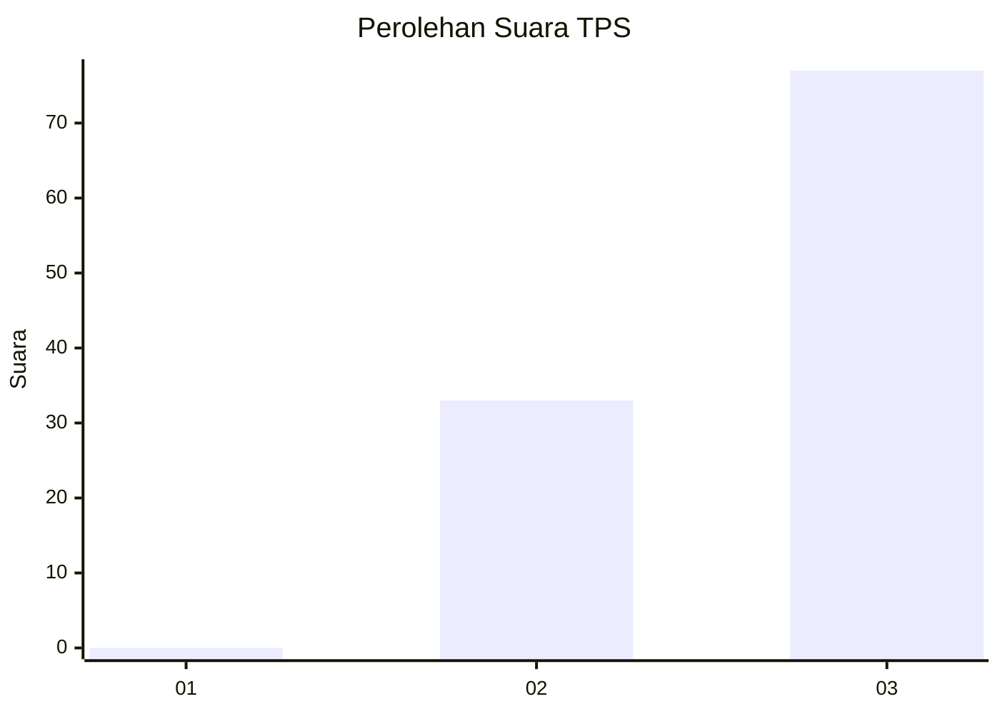
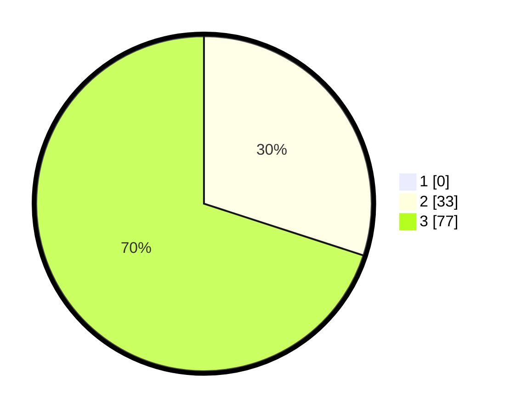

# Hasil

## Grafik

## Tabel

| No. | Nama Paslon    | Suara | Suara (raw) | Persentase |
|:--- |:-------------- | -----:| -----------:| ----------:|
| 1   | ANIES MUHAIMIN | 0     | [0][p-1]    | 0,00       |
| 2   | PRABOWO GIBRAN | 33    | [33][p-2]   | 30,00      |
| 3   | GANJAR MAHFUD  | 77    | [77][p-3]   | 70,00      |

[p-1]: https://github.com/gigit-pemilu/pemilu-2024-92-papua-barat/blob/main/pilpres/hitung-suara/sub/92-papua-barat/sub/03-fak-fak/sub/12-fakfak-timur-tengah/sub/2005-kalamanuk/sub/001-tps/sub/paslon-1.txt
[p-2]: https://github.com/gigit-pemilu/pemilu-2024-92-papua-barat/blob/main/pilpres/hitung-suara/sub/92-papua-barat/sub/03-fak-fak/sub/12-fakfak-timur-tengah/sub/2005-kalamanuk/sub/001-tps/sub/paslon-2.txt
[p-3]: https://github.com/gigit-pemilu/pemilu-2024-92-papua-barat/blob/main/pilpres/hitung-suara/sub/92-papua-barat/sub/03-fak-fak/sub/12-fakfak-timur-tengah/sub/2005-kalamanuk/sub/001-tps/sub/paslon-3.txt

## Foto C Plano

https://sirekap-obj-formc.kpu.go.id/62a2/pemilu/ppwp/92/03/12/20/05/9203122005001-20240215-111847--a040e004-479f-4da8-842c-d0bf6cad38fe.jpg

https://sirekap-obj-formc.kpu.go.id/62a2/pemilu/ppwp/92/03/12/20/05/9203122005001-20240215-111500--d16a2254-e62a-44e8-acb7-1438bbf1b397.jpg

## Metadata

| Key        | Value               |
| ---------- | ------------------- |
| Time Stamp | 2024-02-24 23:00:00 |

