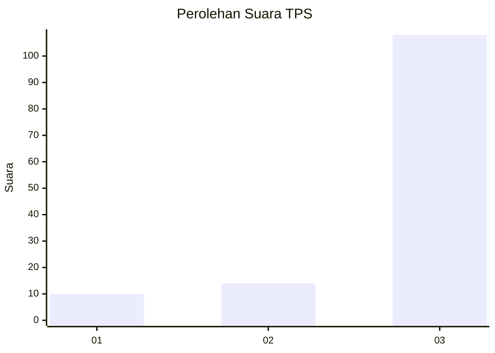
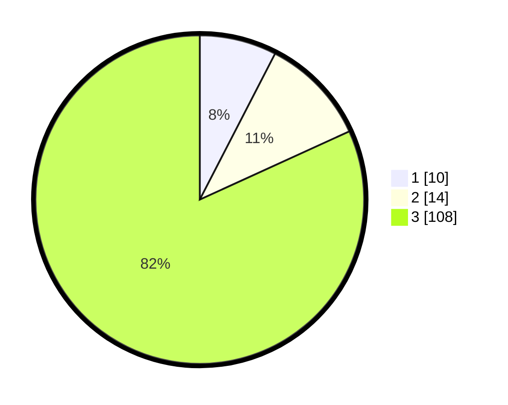

# Hasil

## Grafik

## Tabel

| No. | Nama Paslon    | Suara | Suara (raw) | Persentase |
|:--- |:-------------- | -----:| -----------:| ----------:|
| 1   | ANIES MUHAIMIN | 10    | [10][p-1]   | 7,58       |
| 2   | PRABOWO GIBRAN | 14    | [14][p-2]   | 10,61      |
| 3   | GANJAR MAHFUD  | 108   | [108][p-3]  | 81,82      |

[p-1]: https://github.com/gigit-pemilu/pemilu-2024-92-papua-barat/blob/main/pilpres/hitung-suara/sub/92-papua-barat/sub/03-fak-fak/sub/12-fakfak-timur-tengah/sub/2006-wayati-timur/sub/001-tps/sub/paslon-1.txt
[p-2]: https://github.com/gigit-pemilu/pemilu-2024-92-papua-barat/blob/main/pilpres/hitung-suara/sub/92-papua-barat/sub/03-fak-fak/sub/12-fakfak-timur-tengah/sub/2006-wayati-timur/sub/001-tps/sub/paslon-2.txt
[p-3]: https://github.com/gigit-pemilu/pemilu-2024-92-papua-barat/blob/main/pilpres/hitung-suara/sub/92-papua-barat/sub/03-fak-fak/sub/12-fakfak-timur-tengah/sub/2006-wayati-timur/sub/001-tps/sub/paslon-3.txt

## Foto C Plano

https://sirekap-obj-formc.kpu.go.id/c182/pemilu/ppwp/92/03/12/20/06/9203122006001-20240215-165600--9e491f89-903e-4e37-b391-50f4f4656101.jpg

https://sirekap-obj-formc.kpu.go.id/c182/pemilu/ppwp/92/03/12/20/06/9203122006001-20240215-170906--552ea80b-b31c-4401-a221-a6fd37a9a7cb.jpg

https://sirekap-obj-formc.kpu.go.id/c182/pemilu/ppwp/92/03/12/20/06/9203122006001-20240215-170116--8d5981a7-97a4-41be-bf86-f7bd65b09af7.jpg

## Metadata

| Key        | Value               |
| ---------- | ------------------- |
| Time Stamp | 2024-02-24 22:31:28 |

