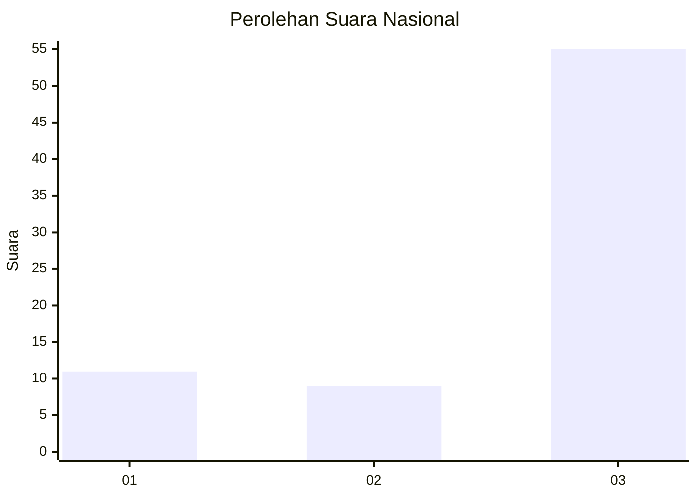
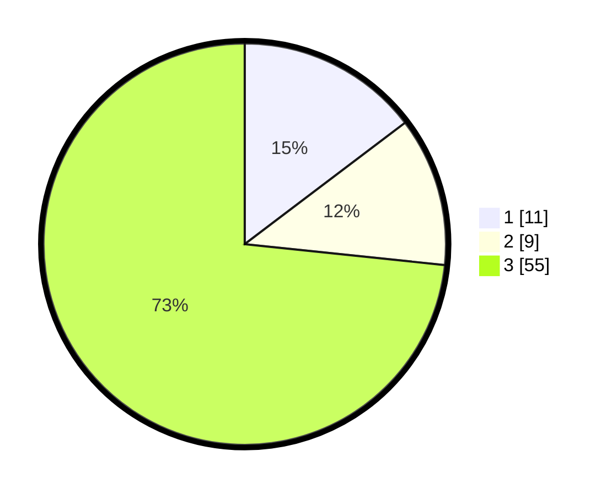

# Hasil

## Grafik

## Tabel

| No. | Nama Paslon    | Suara | Suara (raw) | Persentase |
|:--- |:-------------- | -----:| -----------:| ----------:|
| 1   | ANIES MUHAIMIN | 11    | [11][p-1]   | 14,67      |
| 2   | PRABOWO GIBRAN | 9     | [9][p-2]    | 12,00      |
| 3   | GANJAR MAHFUD  | 55    | [55][p-3]   | 73,33      |

[p-1]: https://github.com/gigit-pemilu/pemilu-2024/blob/main/pilpres/hitung-suara/sub/92-papua-barat/sub/03-fak-fak/sub/16-furwagi/sub/2008-twootkindik/sub/001-tps/sub/paslon-1.txt
[p-2]: https://github.com/gigit-pemilu/pemilu-2024/blob/main/pilpres/hitung-suara/sub/92-papua-barat/sub/03-fak-fak/sub/16-furwagi/sub/2008-twootkindik/sub/001-tps/sub/paslon-2.txt
[p-3]: https://github.com/gigit-pemilu/pemilu-2024/blob/main/pilpres/hitung-suara/sub/92-papua-barat/sub/03-fak-fak/sub/16-furwagi/sub/2008-twootkindik/sub/001-tps/sub/paslon-3.txt

## Foto C Plano

https://sirekap-obj-formc.kpu.go.id/04dc/pemilu/ppwp/92/03/16/20/08/9203162008001-20240216-124423--998306e1-c6d6-4bc4-8293-28481ce3853d.jpg

https://sirekap-obj-formc.kpu.go.id/04dc/pemilu/ppwp/92/03/16/20/08/9203162008001-20240216-124518--d51a5eb8-4373-45b9-8df7-a963f6d03642.jpg

https://sirekap-obj-formc.kpu.go.id/04dc/pemilu/ppwp/92/03/16/20/08/9203162008001-20240216-124521--3bd22a17-9414-4a60-b009-a47863c00868.jpg

## Metadata

| Key        | Value               |
| ---------- | ------------------- |
| Time Stamp | 2024-02-25 21:00:00 |

