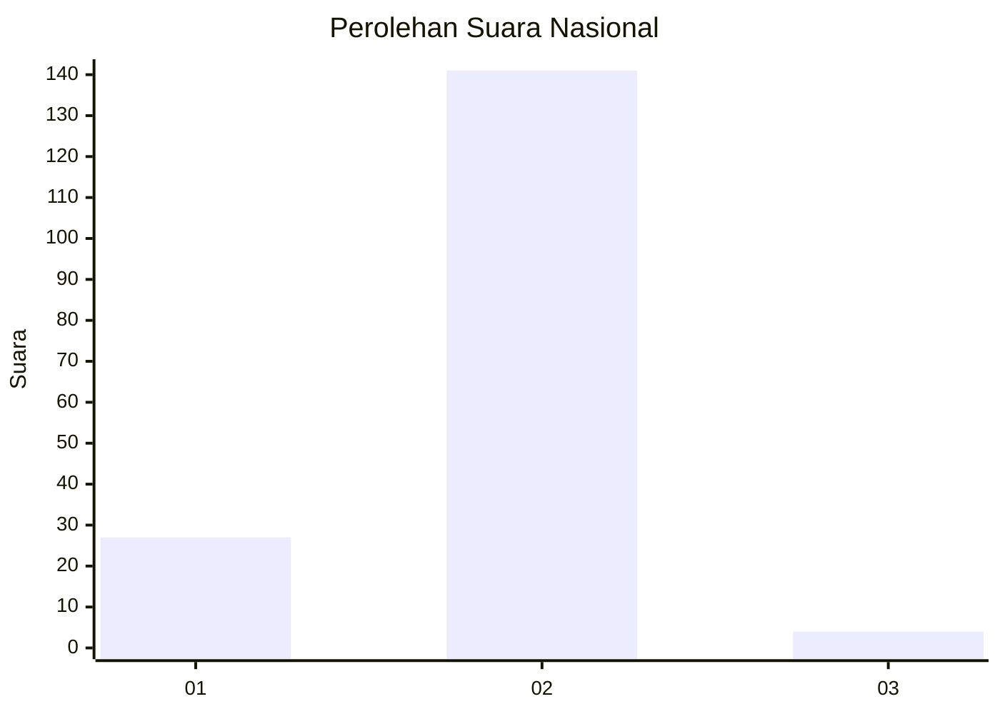
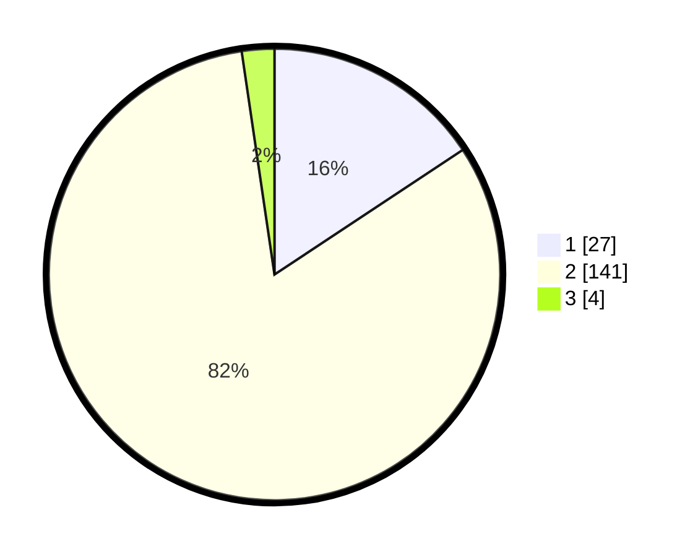

# Hasil

## Grafik

## Tabel

| No. | Nama Paslon    | Suara | Suara (raw) | Persentase |
|:--- |:-------------- | -----:| -----------:| ----------:|
| 1   | ANIES MUHAIMIN | 27    | [27][p-1]   | 15,70      |
| 2   | PRABOWO GIBRAN | 141   | [141][p-2]  | 81,98      |
| 3   | GANJAR MAHFUD  | 4     | [4][p-3]    | 2,33       |

[p-1]: https://github.com/gigit-pemilu/pemilu-2024/blob/main/pilpres/hitung-suara/sub/92-papua-barat/sub/03-fak-fak/sub/17-tomage/sub/2008-wasa-mulya/sub/001-tps/sub/paslon-1.txt
[p-2]: https://github.com/gigit-pemilu/pemilu-2024/blob/main/pilpres/hitung-suara/sub/92-papua-barat/sub/03-fak-fak/sub/17-tomage/sub/2008-wasa-mulya/sub/001-tps/sub/paslon-2.txt
[p-3]: https://github.com/gigit-pemilu/pemilu-2024/blob/main/pilpres/hitung-suara/sub/92-papua-barat/sub/03-fak-fak/sub/17-tomage/sub/2008-wasa-mulya/sub/001-tps/sub/paslon-3.txt

## Foto C Plano

https://sirekap-obj-formc.kpu.go.id/efb2/pemilu/ppwp/92/03/17/20/08/9203172008001-20240215-031845--d9b79e0d-764a-42d6-8e92-8d81c3b8d63b.jpg

https://sirekap-obj-formc.kpu.go.id/efb2/pemilu/ppwp/92/03/17/20/08/9203172008001-20240215-055922--08205f8e-3bf8-4c1e-bc0c-d23abf8bf1e6.jpg

https://sirekap-obj-formc.kpu.go.id/efb2/pemilu/ppwp/92/03/17/20/08/9203172008001-20240215-032450--32381438-4f04-4967-8109-62a8886093f8.jpg

## Metadata

| Key        | Value               |
| ---------- | ------------------- |
| Time Stamp | 2024-02-25 23:00:00 |

