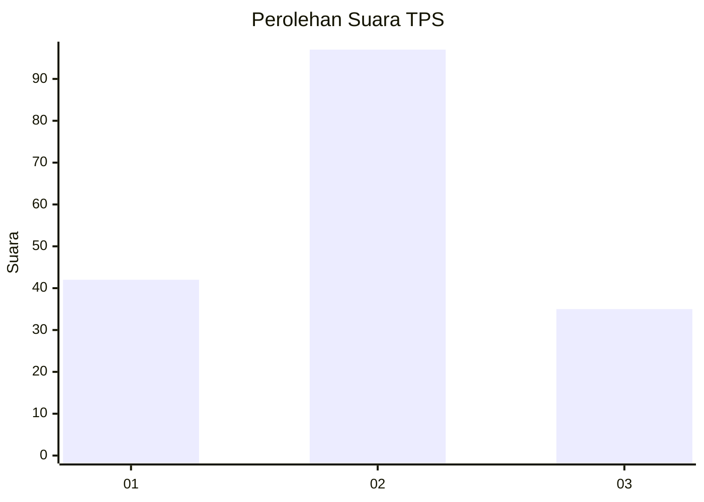
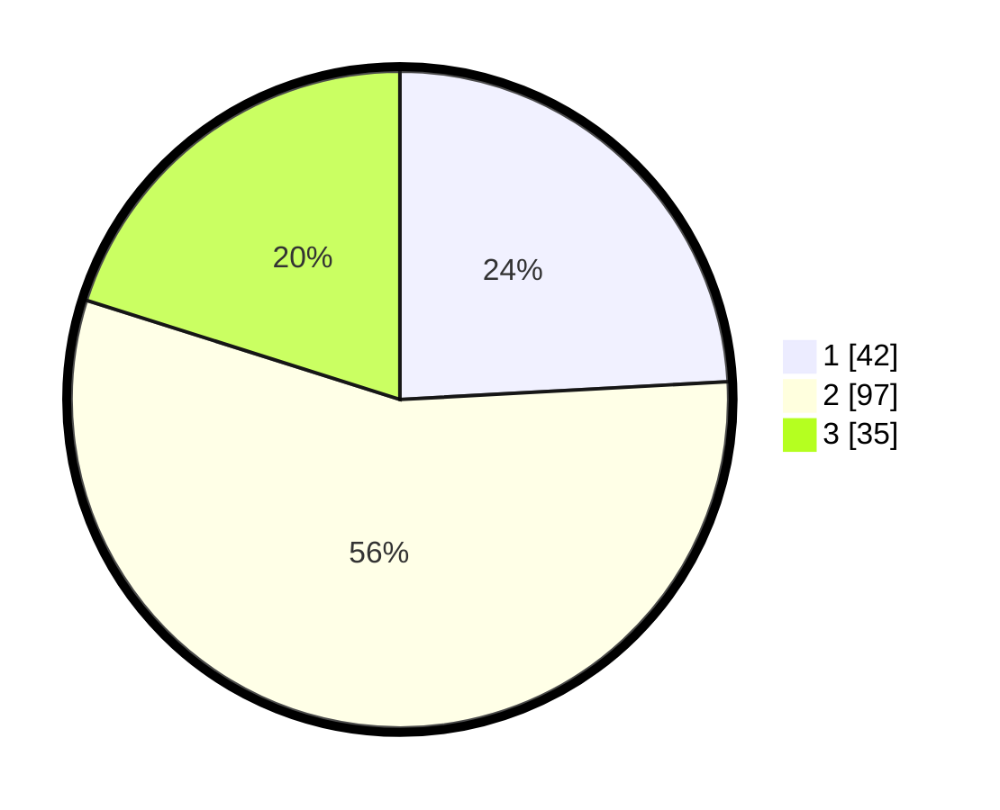

# Hasil

## Grafik

## Tabel

| No. | Nama Paslon    | Suara | Suara (raw) | Persentase |
|:--- |:-------------- | -----:| -----------:| ----------:|
| 1   | ANIES MUHAIMIN | 42    | [42][p-1]   | 24,14      |
| 2   | PRABOWO GIBRAN | 97    | [97][p-2]   | 55,75      |
| 3   | GANJAR MAHFUD  | 35    | [35][p-3]   | 20,11      |

[p-1]: https://github.com/gigit-pemilu/pemilu-2024-92-papua-barat/blob/main/pilpres/hitung-suara/sub/92-papua-barat/sub/06-teluk-bintuni/sub/01-bintuni/sub/1001-bintuni-timur/sub/001-tps/sub/paslon-1.txt
[p-2]: https://github.com/gigit-pemilu/pemilu-2024-92-papua-barat/blob/main/pilpres/hitung-suara/sub/92-papua-barat/sub/06-teluk-bintuni/sub/01-bintuni/sub/1001-bintuni-timur/sub/001-tps/sub/paslon-2.txt
[p-3]: https://github.com/gigit-pemilu/pemilu-2024-92-papua-barat/blob/main/pilpres/hitung-suara/sub/92-papua-barat/sub/06-teluk-bintuni/sub/01-bintuni/sub/1001-bintuni-timur/sub/001-tps/sub/paslon-3.txt

## Foto C Plano

https://sirekap-obj-formc.kpu.go.id/be2d/pemilu/ppwp/92/06/01/10/01/9206011001001-20240214-131651--774f4609-03f5-4393-ace8-d7b698259e03.jpg

https://sirekap-obj-formc.kpu.go.id/be2d/pemilu/ppwp/92/06/01/10/01/9206011001001-20240214-131544--46b8ada9-da46-474c-b820-0e2e79941750.jpg

https://sirekap-obj-formc.kpu.go.id/be2d/pemilu/ppwp/92/06/01/10/01/9206011001001-20240214-131829--efeab0b9-c959-4fc8-809e-3add04e1af02.jpg

## Metadata

| Key        | Value               |
| ---------- | ------------------- |
| Time Stamp | 2024-02-25 11:00:00 |

