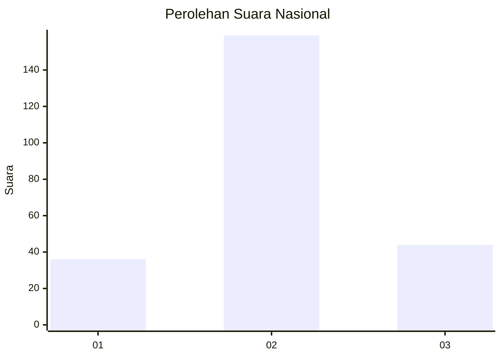
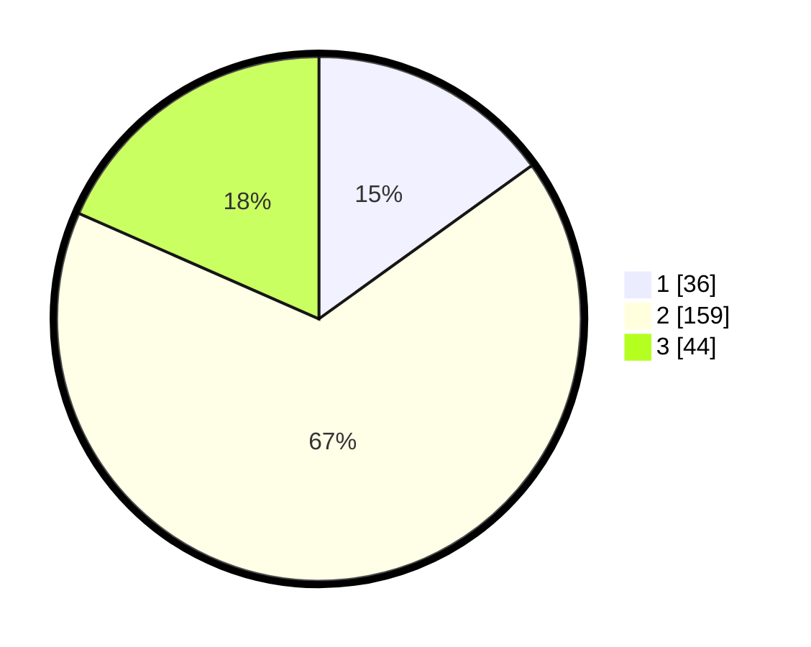

# Hasil

## Grafik

## Tabel

| No. | Nama Paslon    | Suara | Suara (raw) | Persentase |
|:--- |:-------------- | -----:| -----------:| ----------:|
| 1   | ANIES MUHAIMIN | 36    | [36][p-1]   | 15,06      |
| 2   | PRABOWO GIBRAN | 159   | [159][p-2]  | 66,53      |
| 3   | GANJAR MAHFUD  | 44    | [44][p-3]   | 18,41      |

[p-1]: https://github.com/gigit-pemilu/pemilu-2024/blob/main/pilpres/hitung-suara/sub/92-papua-barat/sub/06-teluk-bintuni/sub/01-bintuni/sub/1001-bintuni-timur/sub/004-tps/sub/paslon-1.txt
[p-2]: https://github.com/gigit-pemilu/pemilu-2024/blob/main/pilpres/hitung-suara/sub/92-papua-barat/sub/06-teluk-bintuni/sub/01-bintuni/sub/1001-bintuni-timur/sub/004-tps/sub/paslon-2.txt
[p-3]: https://github.com/gigit-pemilu/pemilu-2024/blob/main/pilpres/hitung-suara/sub/92-papua-barat/sub/06-teluk-bintuni/sub/01-bintuni/sub/1001-bintuni-timur/sub/004-tps/sub/paslon-3.txt

## Foto C Plano

https://sirekap-obj-formc.kpu.go.id/e22c/pemilu/ppwp/92/06/01/10/01/9206011001004-20240215-131527--6134ac7d-468f-4c85-9816-c24f5c89df3d.jpg

https://sirekap-obj-formc.kpu.go.id/e22c/pemilu/ppwp/92/06/01/10/01/9206011001004-20240215-130421--e2d9646d-3e7f-4fef-89f3-2f9f48e67208.jpg

https://sirekap-obj-formc.kpu.go.id/e22c/pemilu/ppwp/92/06/01/10/01/9206011001004-20240215-130626--e6efe94d-c90e-43c5-a8ee-402eeed82de3.jpg

## Metadata

| Key        | Value               |
| ---------- | ------------------- |
| Time Stamp | 2024-02-16 22:01:00 |

