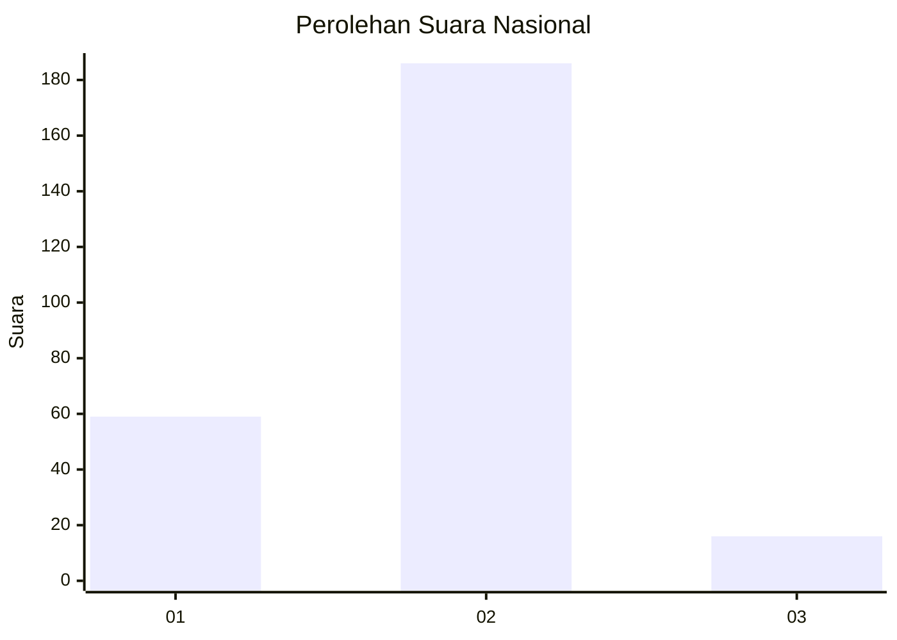

# Hasil

## Grafik

## Tabel

| No. | Nama Paslon    | Suara | Suara (raw) | Persentase |
|:--- |:-------------- | -----:| -----------:| ----------:|
| 1   | ANIES MUHAIMIN | 59    | [59][p-1]   | 22,61      |
| 2   | PRABOWO GIBRAN | 186   | [186][p-2]  | 71,26      |
| 3   | GANJAR MAHFUD  | 16    | [16][p-3]   | 6,13       |

[p-1]: https://github.com/gigit-pemilu/pemilu-2024/blob/main/pilpres/hitung-suara/sub/92-papua-barat/sub/06-teluk-bintuni/sub/01-bintuni/sub/1001-bintuni-timur/sub/015-tps/sub/paslon-1.txt
[p-2]: https://github.com/gigit-pemilu/pemilu-2024/blob/main/pilpres/hitung-suara/sub/92-papua-barat/sub/06-teluk-bintuni/sub/01-bintuni/sub/1001-bintuni-timur/sub/015-tps/sub/paslon-2.txt
[p-3]: https://github.com/gigit-pemilu/pemilu-2024/blob/main/pilpres/hitung-suara/sub/92-papua-barat/sub/06-teluk-bintuni/sub/01-bintuni/sub/1001-bintuni-timur/sub/015-tps/sub/paslon-3.txt

## Foto C Plano

https://sirekap-obj-formc.kpu.go.id/9eab/pemilu/ppwp/92/06/01/10/01/9206011001015-20240215-230707--c6af0d44-9182-4d7a-9baa-368bcf52ba1e.jpg

https://sirekap-obj-formc.kpu.go.id/9eab/pemilu/ppwp/92/06/01/10/01/9206011001015-20240215-231048--276c8ee4-99fd-4820-9996-2d152880f5c2.jpg

https://sirekap-obj-formc.kpu.go.id/9eab/pemilu/ppwp/92/06/01/10/01/9206011001015-20240215-231222--e5fa1783-d1cf-4c51-96f0-7337af3f21c5.jpg

## Metadata

| Key        | Value               |
| ---------- | ------------------- |
| Time Stamp | 2024-02-24 22:31:28 |

