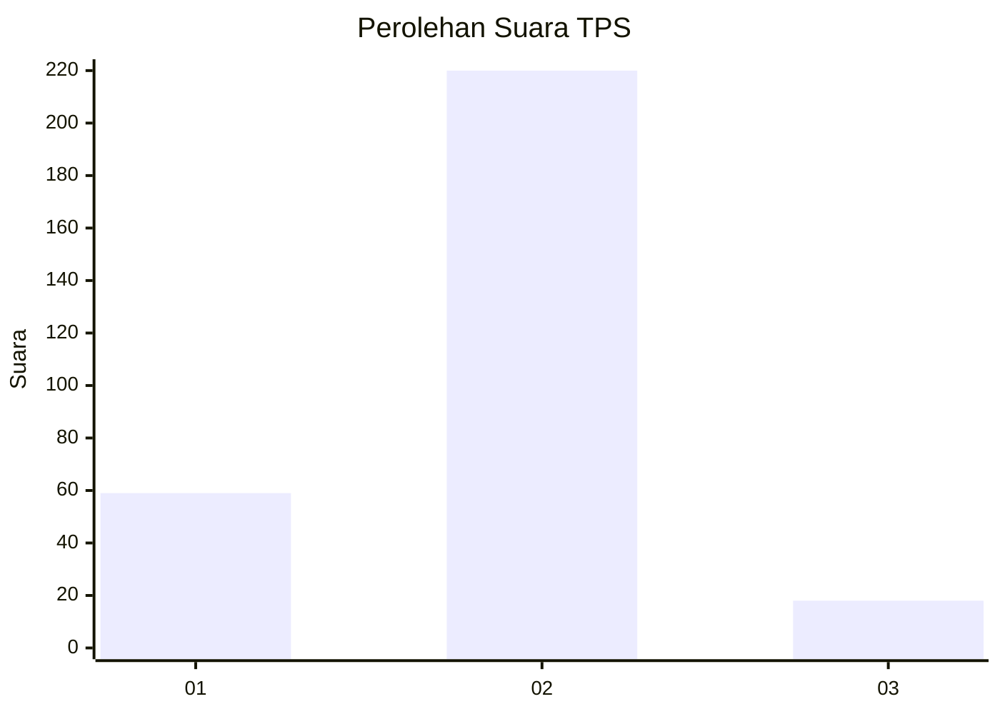

# Hasil

## Grafik

## Tabel

| No. | Nama Paslon    | Suara | Suara (raw) | Persentase |
|:--- |:-------------- | -----:| -----------:| ----------:|
| 1   | ANIES MUHAIMIN | 59    | [59][p-1]   | 19,87      |
| 2   | PRABOWO GIBRAN | 220   | [220][p-2]  | 74,07      |
| 3   | GANJAR MAHFUD  | 18    | [18][p-3]   | 6,06       |

[p-1]: https://github.com/gigit-pemilu/pemilu-2024-92-papua-barat/blob/main/pilpres/hitung-suara/sub/92-papua-barat/sub/06-teluk-bintuni/sub/01-bintuni/sub/1001-bintuni-timur/sub/016-tps/sub/paslon-1.txt
[p-2]: https://github.com/gigit-pemilu/pemilu-2024-92-papua-barat/blob/main/pilpres/hitung-suara/sub/92-papua-barat/sub/06-teluk-bintuni/sub/01-bintuni/sub/1001-bintuni-timur/sub/016-tps/sub/paslon-2.txt
[p-3]: https://github.com/gigit-pemilu/pemilu-2024-92-papua-barat/blob/main/pilpres/hitung-suara/sub/92-papua-barat/sub/06-teluk-bintuni/sub/01-bintuni/sub/1001-bintuni-timur/sub/016-tps/sub/paslon-3.txt

## Foto C Plano

https://sirekap-obj-formc.kpu.go.id/a238/pemilu/ppwp/92/06/01/10/01/9206011001016-20240215-015439--e40657de-e766-45f0-9f33-739ad5053833.jpg

https://sirekap-obj-formc.kpu.go.id/a238/pemilu/ppwp/92/06/01/10/01/9206011001016-20240215-015610--f33566d8-8b3c-447d-b467-49515c4c85ac.jpg

https://sirekap-obj-formc.kpu.go.id/a238/pemilu/ppwp/92/06/01/10/01/9206011001016-20240215-015720--b3832d46-2e87-47a0-8051-fd93c11f1fcd.jpg

## Metadata

| Key        | Value               |
| ---------- | ------------------- |
| Time Stamp | 2024-02-16 22:01:00 |

