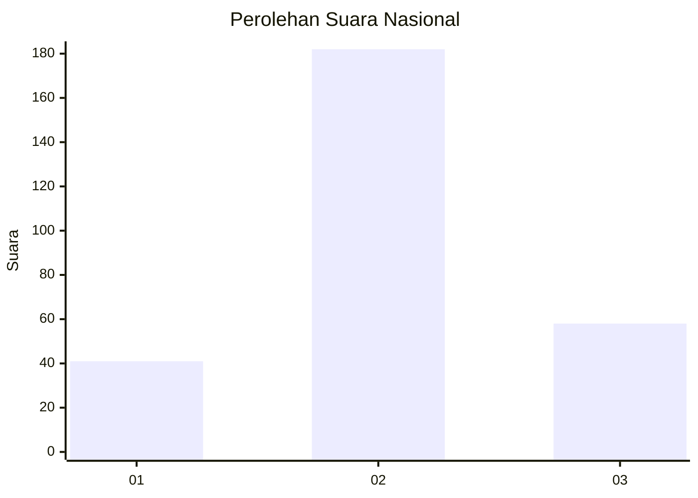
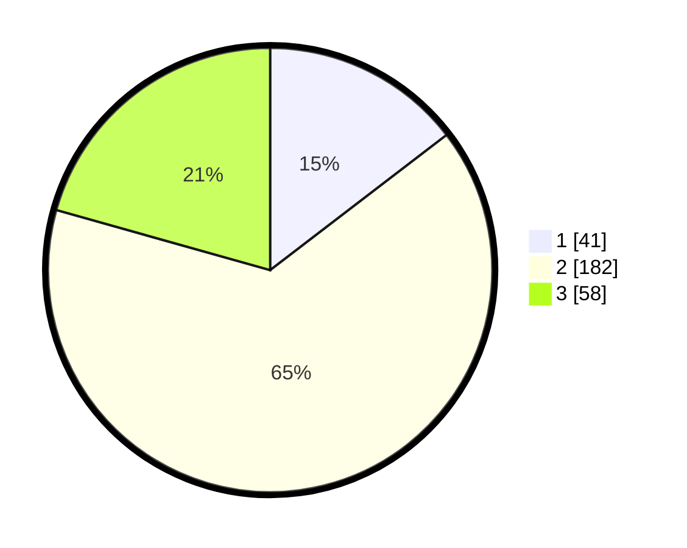

# Hasil

## Grafik

## Tabel

| No. | Nama Paslon    | Suara | Suara (raw) | Persentase |
|:--- |:-------------- | -----:| -----------:| ----------:|
| 1   | ANIES MUHAIMIN | 41    | [41][p-1]   | 14,59      |
| 2   | PRABOWO GIBRAN | 182   | [182][p-2]  | 64,77      |
| 3   | GANJAR MAHFUD  | 58    | [58][p-3]   | 20,64      |

[p-1]: https://github.com/gigit-pemilu/pemilu-2024/blob/main/pilpres/hitung-suara/sub/92-papua-barat/sub/06-teluk-bintuni/sub/01-bintuni/sub/1001-bintuni-timur/sub/020-tps/sub/paslon-1.txt
[p-2]: https://github.com/gigit-pemilu/pemilu-2024/blob/main/pilpres/hitung-suara/sub/92-papua-barat/sub/06-teluk-bintuni/sub/01-bintuni/sub/1001-bintuni-timur/sub/020-tps/sub/paslon-2.txt
[p-3]: https://github.com/gigit-pemilu/pemilu-2024/blob/main/pilpres/hitung-suara/sub/92-papua-barat/sub/06-teluk-bintuni/sub/01-bintuni/sub/1001-bintuni-timur/sub/020-tps/sub/paslon-3.txt

## Foto C Plano

https://sirekap-obj-formc.kpu.go.id/281f/pemilu/ppwp/92/06/01/10/01/9206011001020-20240215-100111--d1a01c45-527a-43ea-ad35-866b0e421839.jpg

https://sirekap-obj-formc.kpu.go.id/281f/pemilu/ppwp/92/06/01/10/01/9206011001020-20240215-100233--80b4bba8-18a6-468a-853b-11f02bcda909.jpg

https://sirekap-obj-formc.kpu.go.id/281f/pemilu/ppwp/92/06/01/10/01/9206011001020-20240215-100350--e0a2a0b8-2d98-450d-acd6-74b13a71167e.jpg

## Metadata

| Key        | Value               |
| ---------- | ------------------- |
| Time Stamp | 2024-02-16 22:01:00 |

## DATA PEMILIH TETAP

Jumlah pemilih dalam DPT: **287**.
 * L: **154**.
 * P: **123**.

## DATA PENGGUNA HAK PILIH

Jumlah pengguna hak pilih dalam DPT: **245**.
 * L: **154**.
 * P: **123**.

Jumlah pengguna hak pilih dalam DPTb: **385**.
 * L: **884**.
 * P: **282**.

Jumlah pengguna hak pilih dalam DPK: **804**.
 * L: **830**.
 * P: **848**.

Jumlah pengguna hak pilih: **293**.
 * L: **221**.
 * P: **882**.

## JUMLAH SUARA SAH DAN TIDAK SAH

JUMLAH SELURUH SUARA SAH: **281**.

JUMLAH SUARA TIDAK SAH: **12**.

JUMLAH SELURUH SUARA SAH DAN SUARA TIDAK SAH: **293**.

