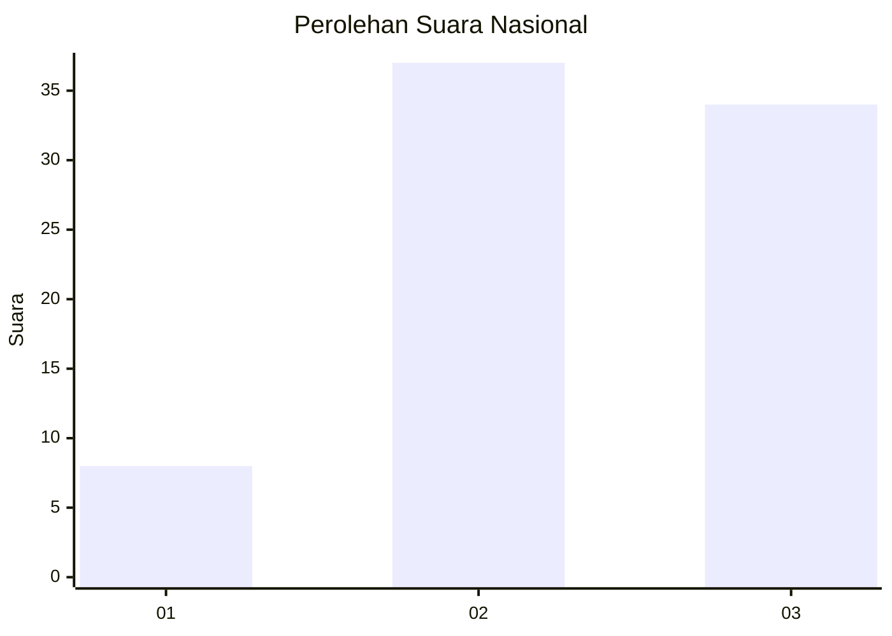
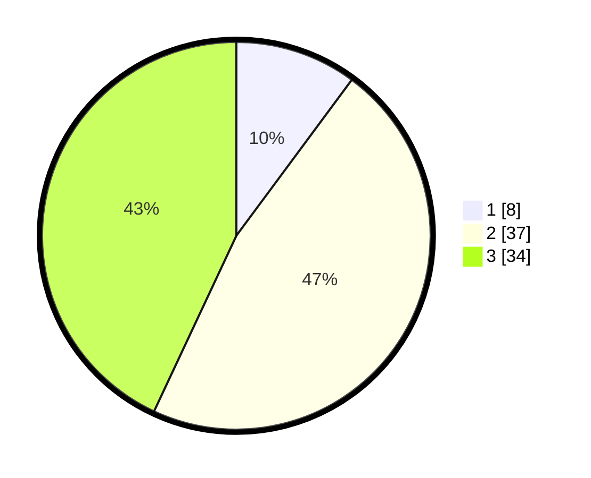

# Hasil

## Grafik

## Tabel

| No. | Nama Paslon    | Suara | Suara (raw) | Persentase |
|:--- |:-------------- | -----:| -----------:| ----------:|
| 1   | ANIES MUHAIMIN | 8     | [8][p-1]    | 10,13      |
| 2   | PRABOWO GIBRAN | 37    | [37][p-2]   | 46,84      |
| 3   | GANJAR MAHFUD  | 34    | [34][p-3]   | 43,04      |

[p-1]: https://github.com/gigit-pemilu/pemilu-2024/blob/main/pilpres/hitung-suara/sub/92-papua-barat/sub/06-teluk-bintuni/sub/01-bintuni/sub/2026-wesiri/sub/901-tps/sub/paslon-1.txt
[p-2]: https://github.com/gigit-pemilu/pemilu-2024/blob/main/pilpres/hitung-suara/sub/92-papua-barat/sub/06-teluk-bintuni/sub/01-bintuni/sub/2026-wesiri/sub/901-tps/sub/paslon-2.txt
[p-3]: https://github.com/gigit-pemilu/pemilu-2024/blob/main/pilpres/hitung-suara/sub/92-papua-barat/sub/06-teluk-bintuni/sub/01-bintuni/sub/2026-wesiri/sub/901-tps/sub/paslon-3.txt

## Foto C Plano

https://sirekap-obj-formc.kpu.go.id/7433/pemilu/ppwp/92/06/01/20/26/9206012026901-20240214-195617--95b71fc2-e8f4-462f-b948-b71066ce3b63.jpg

https://sirekap-obj-formc.kpu.go.id/7433/pemilu/ppwp/92/06/01/20/26/9206012026901-20240214-195701--780614ef-57a3-4bba-af76-6acc07c6c024.jpg

https://sirekap-obj-formc.kpu.go.id/7433/pemilu/ppwp/92/06/01/20/26/9206012026901-20240214-195715--5ebdeb3f-c8b9-44b7-a661-354a4d5247cd.jpg

## Metadata

| Key        | Value               |
| ---------- | ------------------- |
| Time Stamp | 2024-02-25 18:00:00 |

