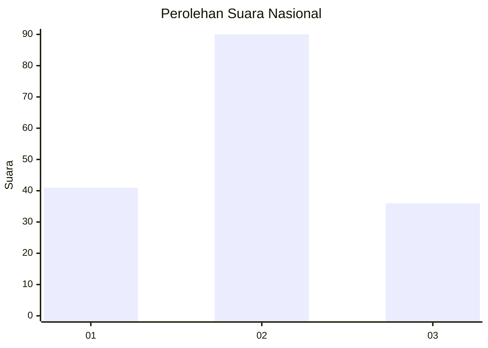
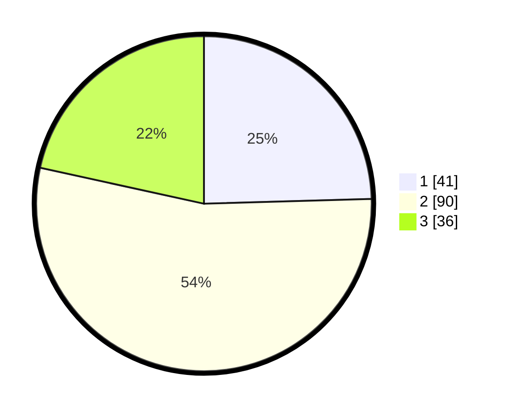

# Hasil

## Grafik

## Tabel

| No. | Nama Paslon    | Suara | Suara (raw) | Persentase |
|:--- |:-------------- | -----:| -----------:| ----------:|
| 1   | ANIES MUHAIMIN | 41    | [41][p-1]   | 24,55      |
| 2   | PRABOWO GIBRAN | 90    | [90][p-2]   | 53,89      |
| 3   | GANJAR MAHFUD  | 36    | [36][p-3]   | 21,56      |

[p-1]: https://github.com/gigit-pemilu/pemilu-2024/blob/main/pilpres/hitung-suara/sub/92-papua-barat/sub/06-teluk-bintuni/sub/03-babo/sub/2020-irarutu-iii/sub/003-tps/sub/paslon-1.txt
[p-2]: https://github.com/gigit-pemilu/pemilu-2024/blob/main/pilpres/hitung-suara/sub/92-papua-barat/sub/06-teluk-bintuni/sub/03-babo/sub/2020-irarutu-iii/sub/003-tps/sub/paslon-2.txt
[p-3]: https://github.com/gigit-pemilu/pemilu-2024/blob/main/pilpres/hitung-suara/sub/92-papua-barat/sub/06-teluk-bintuni/sub/03-babo/sub/2020-irarutu-iii/sub/003-tps/sub/paslon-3.txt

## Foto C Plano

https://sirekap-obj-formc.kpu.go.id/103c/pemilu/ppwp/92/06/03/20/20/9206032020003-20240217-004524--a8ca0891-ef8a-44ea-85fc-faa1ee880891.jpg

https://sirekap-obj-formc.kpu.go.id/103c/pemilu/ppwp/92/06/03/20/20/9206032020003-20240217-004657--ff1a273e-254e-437f-8261-386564682b75.jpg

https://sirekap-obj-formc.kpu.go.id/103c/pemilu/ppwp/92/06/03/20/20/9206032020003-20240217-004855--50fde8fe-e86d-4c37-be81-fe8a28d52381.jpg

## Metadata

| Key        | Value               |
| ---------- | ------------------- |
| Time Stamp | 2024-02-25 16:00:00 |

