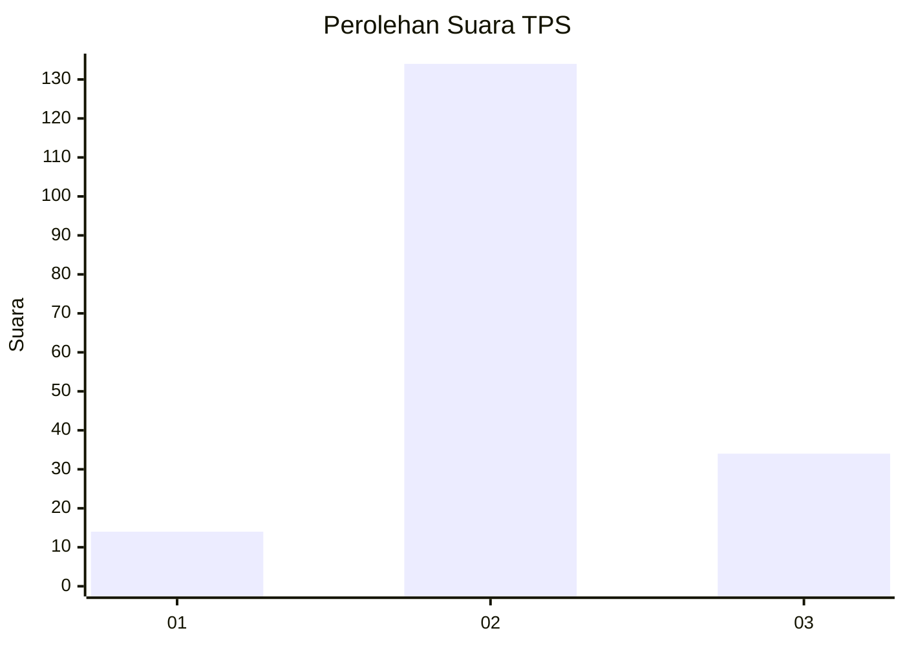
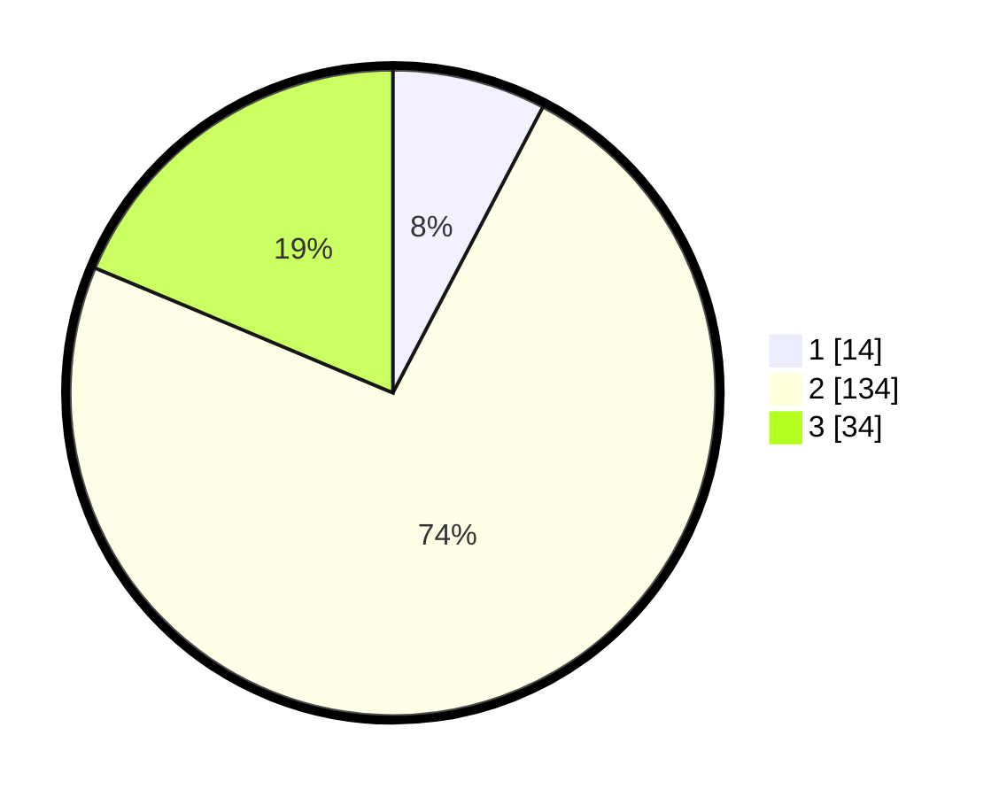

# Hasil

## Grafik

## Tabel

| No. | Nama Paslon    | Suara | Suara (raw) | Persentase |
|:--- |:-------------- | -----:| -----------:| ----------:|
| 1   | ANIES MUHAIMIN | 14    | [14][p-1]   | 7,69       |
| 2   | PRABOWO GIBRAN | 134   | [134][p-2]  | 73,63      |
| 3   | GANJAR MAHFUD  | 34    | [34][p-3]   | 18,68      |

[p-1]: https://github.com/gigit-pemilu/pemilu-2024-92-papua-barat/blob/main/pilpres/hitung-suara/sub/92-papua-barat/sub/06-teluk-bintuni/sub/11-manimeri/sub/2001-bumi-saniari/sub/002-tps/sub/paslon-1.txt
[p-2]: https://github.com/gigit-pemilu/pemilu-2024-92-papua-barat/blob/main/pilpres/hitung-suara/sub/92-papua-barat/sub/06-teluk-bintuni/sub/11-manimeri/sub/2001-bumi-saniari/sub/002-tps/sub/paslon-2.txt
[p-3]: https://github.com/gigit-pemilu/pemilu-2024-92-papua-barat/blob/main/pilpres/hitung-suara/sub/92-papua-barat/sub/06-teluk-bintuni/sub/11-manimeri/sub/2001-bumi-saniari/sub/002-tps/sub/paslon-3.txt

## Foto C Plano

https://sirekap-obj-formc.kpu.go.id/e580/pemilu/ppwp/92/06/11/20/01/9206112001002-20240214-224333--a0b76d0a-0eae-47e3-978e-a00ce1bc622c.jpg

https://sirekap-obj-formc.kpu.go.id/e580/pemilu/ppwp/92/06/11/20/01/9206112001002-20240214-224354--3c03ccf7-cf97-43a3-b2b6-d1b54c9f84d1.jpg

https://sirekap-obj-formc.kpu.go.id/e580/pemilu/ppwp/92/06/11/20/01/9206112001002-20240214-224426--e238f5cb-7736-4b9a-b950-cdee528cf9f0.jpg

## Metadata

| Key        | Value               |
| ---------- | ------------------- |
| Time Stamp | 2024-02-24 22:31:28 |

