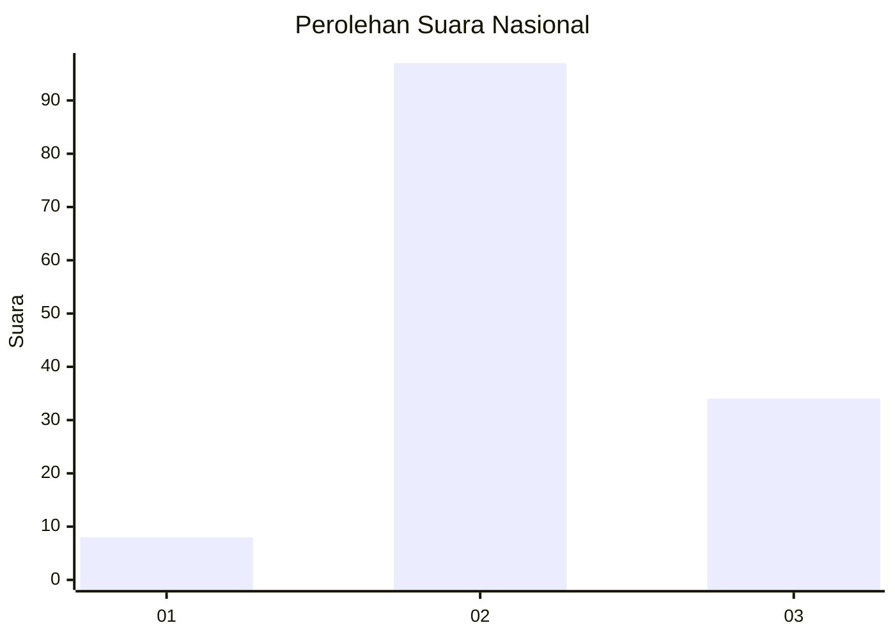
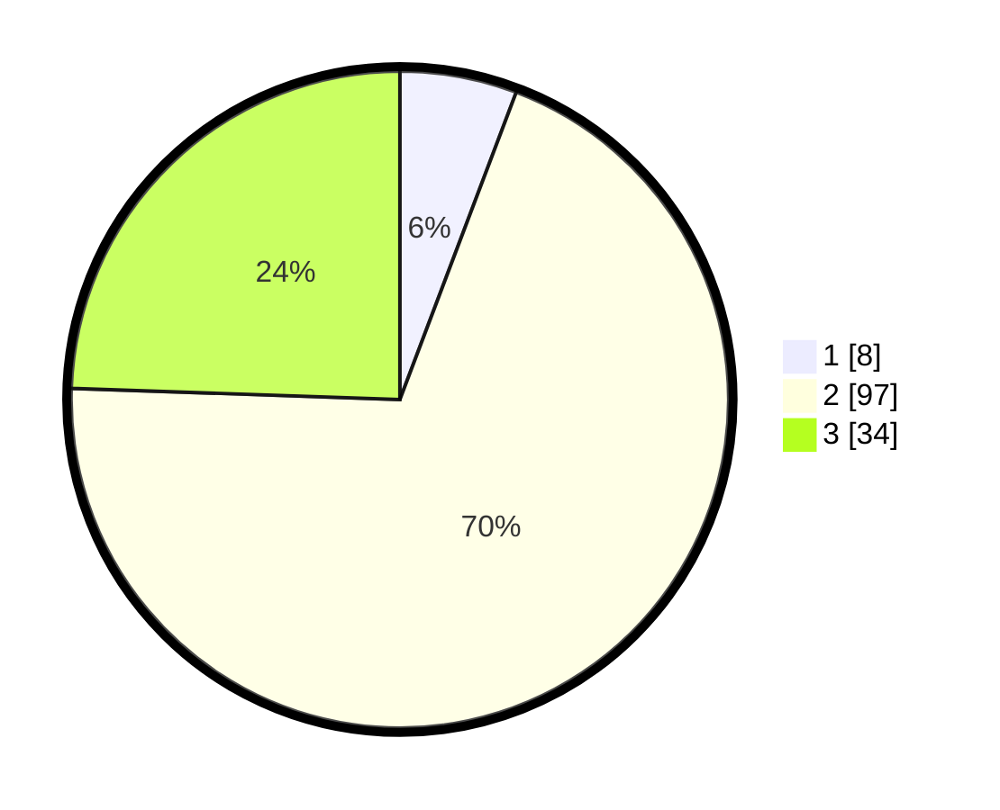

# Hasil

## Grafik

## Tabel

| No. | Nama Paslon    | Suara | Suara (raw) | Persentase |
|:--- |:-------------- | -----:| -----------:| ----------:|
| 1   | ANIES MUHAIMIN | 8     | [8][p-1]    | 5,76       |
| 2   | PRABOWO GIBRAN | 97    | [97][p-2]   | 69,78      |
| 3   | GANJAR MAHFUD  | 34    | [34][p-3]   | 24,46      |

[p-1]: https://github.com/gigit-pemilu/pemilu-2024/blob/main/pilpres/hitung-suara/sub/92-papua-barat/sub/06-teluk-bintuni/sub/11-manimeri/sub/2001-bumi-saniari/sub/005-tps/sub/paslon-1.txt
[p-2]: https://github.com/gigit-pemilu/pemilu-2024/blob/main/pilpres/hitung-suara/sub/92-papua-barat/sub/06-teluk-bintuni/sub/11-manimeri/sub/2001-bumi-saniari/sub/005-tps/sub/paslon-2.txt
[p-3]: https://github.com/gigit-pemilu/pemilu-2024/blob/main/pilpres/hitung-suara/sub/92-papua-barat/sub/06-teluk-bintuni/sub/11-manimeri/sub/2001-bumi-saniari/sub/005-tps/sub/paslon-3.txt

## Foto C Plano

https://sirekap-obj-formc.kpu.go.id/d460/pemilu/ppwp/92/06/11/20/01/9206112001005-20240214-234901--d3250715-2a34-4c2a-9541-a9e948f7dbfb.jpg

https://sirekap-obj-formc.kpu.go.id/d460/pemilu/ppwp/92/06/11/20/01/9206112001005-20240214-235053--0a887668-fc3d-42d9-a47c-33e87ed28fc7.jpg

https://sirekap-obj-formc.kpu.go.id/d460/pemilu/ppwp/92/06/11/20/01/9206112001005-20240214-235311--5c4890c1-ba3c-46a8-9366-aa0629cfc78f.jpg

## Metadata

| Key        | Value               |
| ---------- | ------------------- |
| Time Stamp | 2024-02-26 12:00:00 |

