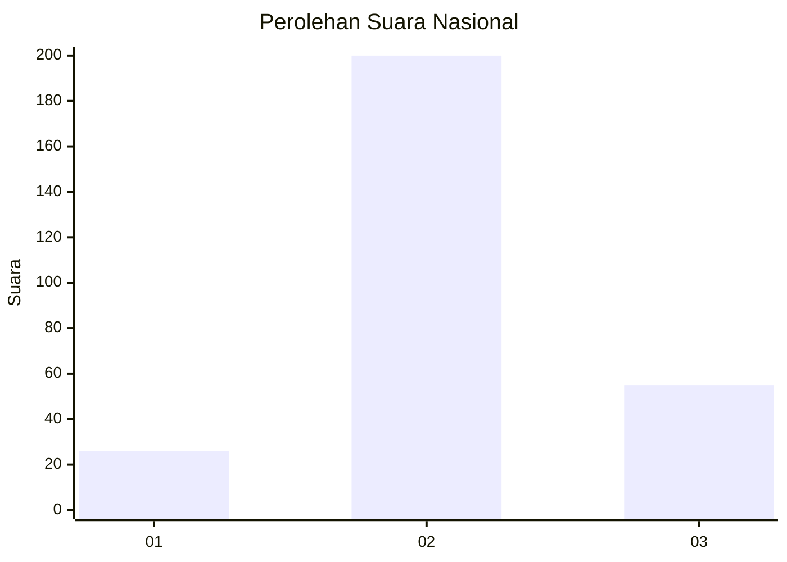
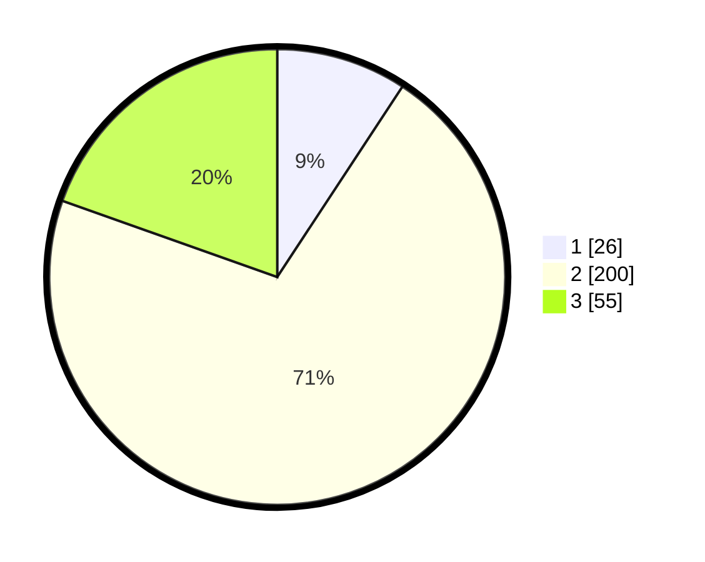

# Hasil

## Grafik

## Tabel

| No. | Nama Paslon    | Suara | Suara (raw) | Persentase |
|:--- |:-------------- | -----:| -----------:| ----------:|
| 1   | ANIES MUHAIMIN | 26    | [26][p-1]   | 9,25       |
| 2   | PRABOWO GIBRAN | 200   | [200][p-2]  | 71,17      |
| 3   | GANJAR MAHFUD  | 55    | [55][p-3]   | 19,57      |

[p-1]: https://github.com/gigit-pemilu/pemilu-2024/blob/main/pilpres/hitung-suara/sub/92-papua-barat/sub/06-teluk-bintuni/sub/11-manimeri/sub/2002-banjar-ausoy/sub/001-tps/sub/paslon-1.txt
[p-2]: https://github.com/gigit-pemilu/pemilu-2024/blob/main/pilpres/hitung-suara/sub/92-papua-barat/sub/06-teluk-bintuni/sub/11-manimeri/sub/2002-banjar-ausoy/sub/001-tps/sub/paslon-2.txt
[p-3]: https://github.com/gigit-pemilu/pemilu-2024/blob/main/pilpres/hitung-suara/sub/92-papua-barat/sub/06-teluk-bintuni/sub/11-manimeri/sub/2002-banjar-ausoy/sub/001-tps/sub/paslon-3.txt

## Foto C Plano

https://sirekap-obj-formc.kpu.go.id/23a8/pemilu/ppwp/92/06/11/20/02/9206112002001-20240214-212508--925c865d-4221-4f42-840d-1fd87a81d9ae.jpg

https://sirekap-obj-formc.kpu.go.id/23a8/pemilu/ppwp/92/06/11/20/02/9206112002001-20240214-212529--9354cb99-eff8-4a41-a5d2-560063067adb.jpg

https://sirekap-obj-formc.kpu.go.id/23a8/pemilu/ppwp/92/06/11/20/02/9206112002001-20240214-212544--9b9015c0-a3e6-42c4-acdd-597f0d900747.jpg

## Metadata

| Key        | Value               |
| ---------- | ------------------- |
| Time Stamp | 2024-02-25 02:00:00 |

