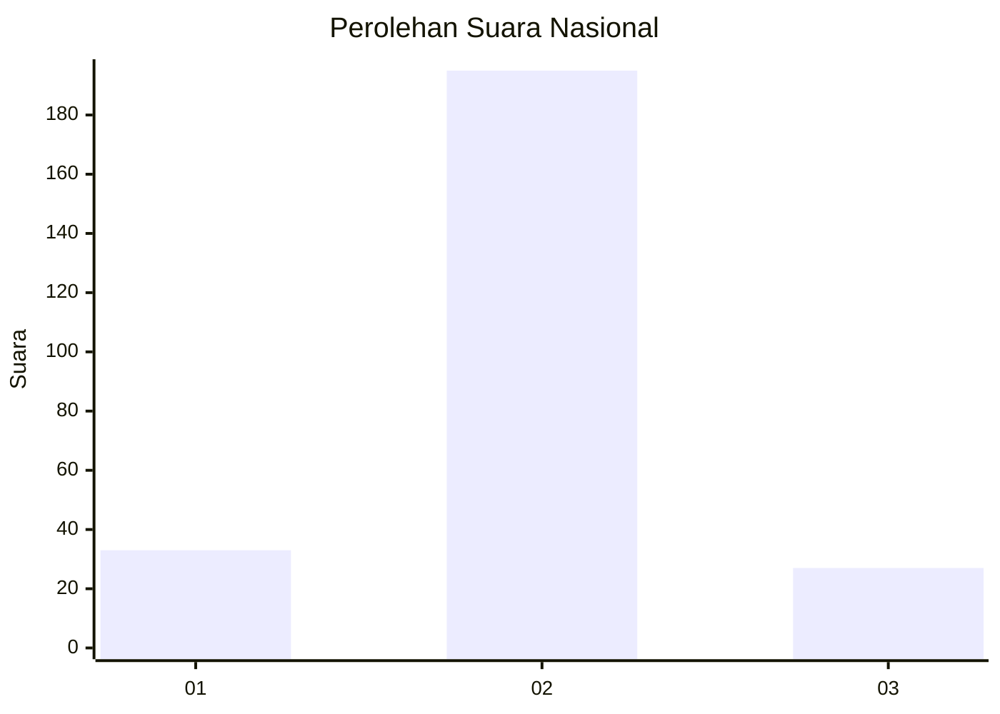
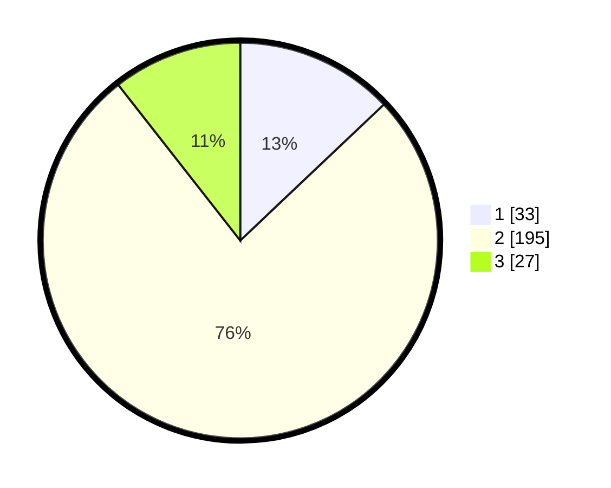

# Hasil

## Grafik

## Tabel

| No. | Nama Paslon    | Suara | Suara (raw) | Persentase |
|:--- |:-------------- | -----:| -----------:| ----------:|
| 1   | ANIES MUHAIMIN | 33    | [33][p-1]   | 12,94      |
| 2   | PRABOWO GIBRAN | 195   | [195][p-2]  | 76,47      |
| 3   | GANJAR MAHFUD  | 27    | [27][p-3]   | 10,59      |

[p-1]: https://github.com/gigit-pemilu/pemilu-2024/blob/main/pilpres/hitung-suara/sub/92-papua-barat/sub/06-teluk-bintuni/sub/11-manimeri/sub/2002-banjar-ausoy/sub/005-tps/sub/paslon-1.txt
[p-2]: https://github.com/gigit-pemilu/pemilu-2024/blob/main/pilpres/hitung-suara/sub/92-papua-barat/sub/06-teluk-bintuni/sub/11-manimeri/sub/2002-banjar-ausoy/sub/005-tps/sub/paslon-2.txt
[p-3]: https://github.com/gigit-pemilu/pemilu-2024/blob/main/pilpres/hitung-suara/sub/92-papua-barat/sub/06-teluk-bintuni/sub/11-manimeri/sub/2002-banjar-ausoy/sub/005-tps/sub/paslon-3.txt

## Foto C Plano

https://sirekap-obj-formc.kpu.go.id/5734/pemilu/ppwp/92/06/11/20/02/9206112002005-20240214-203231--1e8a5036-225a-469b-bfe6-69561c06c05a.jpg

https://sirekap-obj-formc.kpu.go.id/5734/pemilu/ppwp/92/06/11/20/02/9206112002005-20240214-201556--3368df29-788c-46ae-bdac-db2ef9cf58b0.jpg

https://sirekap-obj-formc.kpu.go.id/5734/pemilu/ppwp/92/06/11/20/02/9206112002005-20240214-201952--e4864802-7fc3-4930-bc36-b0da22f61214.jpg

## Metadata

| Key        | Value               |
| ---------- | ------------------- |
| Time Stamp | 2024-02-24 23:00:00 |

