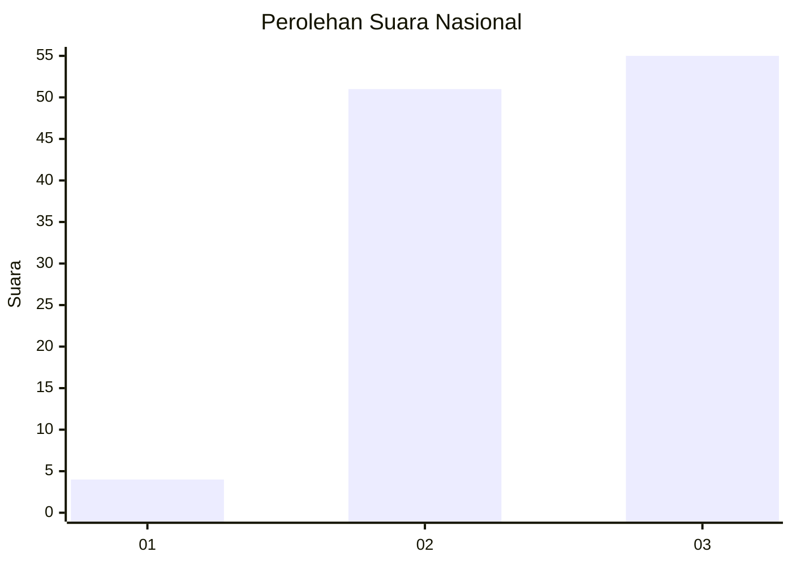
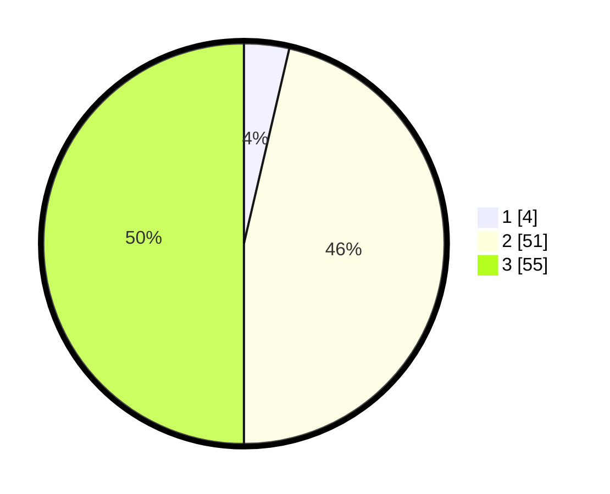

# Hasil

## Grafik

## Tabel

| No. | Nama Paslon    | Suara | Suara (raw) | Persentase |
|:--- |:-------------- | -----:| -----------:| ----------:|
| 1   | ANIES MUHAIMIN | 4     | [4][p-1]    | 3,64       |
| 2   | PRABOWO GIBRAN | 51    | [51][p-2]   | 46,36      |
| 3   | GANJAR MAHFUD  | 55    | [55][p-3]   | 50,00      |

[p-1]: https://github.com/gigit-pemilu/pemilu-2024/blob/main/pilpres/hitung-suara/sub/92-papua-barat/sub/06-teluk-bintuni/sub/11-manimeri/sub/2004-atibo-manimeri/sub/002-tps/sub/paslon-1.txt
[p-2]: https://github.com/gigit-pemilu/pemilu-2024/blob/main/pilpres/hitung-suara/sub/92-papua-barat/sub/06-teluk-bintuni/sub/11-manimeri/sub/2004-atibo-manimeri/sub/002-tps/sub/paslon-2.txt
[p-3]: https://github.com/gigit-pemilu/pemilu-2024/blob/main/pilpres/hitung-suara/sub/92-papua-barat/sub/06-teluk-bintuni/sub/11-manimeri/sub/2004-atibo-manimeri/sub/002-tps/sub/paslon-3.txt

## Foto C Plano

https://sirekap-obj-formc.kpu.go.id/6436/pemilu/ppwp/92/06/11/20/04/9206112004002-20240215-074534--71d5234b-bb22-45a9-86ce-c20b3edeb65c.jpg

https://sirekap-obj-formc.kpu.go.id/6436/pemilu/ppwp/92/06/11/20/04/9206112004002-20240215-074310--1e8b8ff7-c58d-465c-888e-7a4651ef47de.jpg

https://sirekap-obj-formc.kpu.go.id/6436/pemilu/ppwp/92/06/11/20/04/9206112004002-20240215-074431--d7d5a211-d960-40e7-a02f-4af1a900a913.jpg

## Metadata

| Key        | Value               |
| ---------- | ------------------- |
| Time Stamp | 2024-02-21 17:00:00 |

