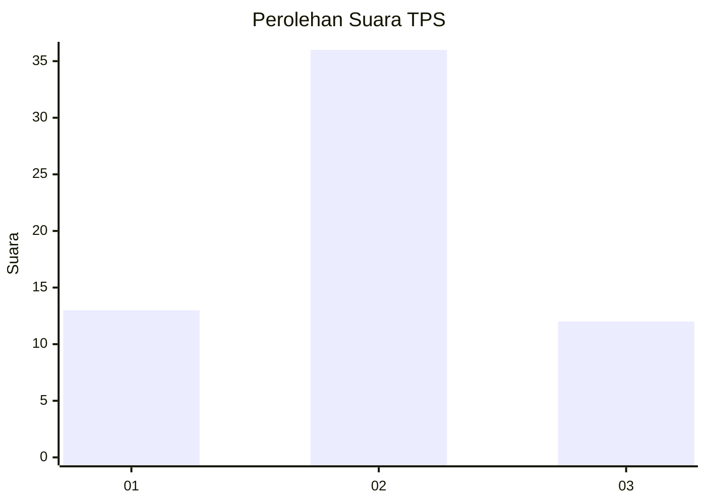
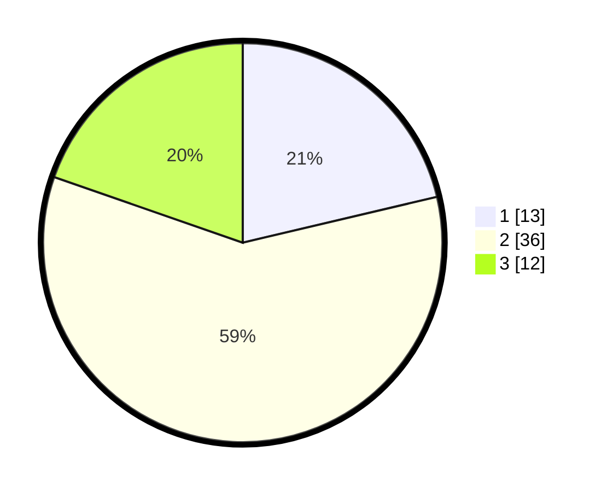

# Hasil

## Grafik

## Tabel

| No. | Nama Paslon    | Suara | Suara (raw) | Persentase |
|:--- |:-------------- | -----:| -----------:| ----------:|
| 1   | ANIES MUHAIMIN | 13    | [13][p-1]   | 21,31      |
| 2   | PRABOWO GIBRAN | 36    | [36][p-2]   | 59,02      |
| 3   | GANJAR MAHFUD  | 12    | [12][p-3]   | 19,67      |

[p-1]: https://github.com/gigit-pemilu/pemilu-2024-92-papua-barat/blob/main/pilpres/hitung-suara/sub/92-papua-barat/sub/06-teluk-bintuni/sub/14-sumuri/sub/2002-tanah-merah/sub/905-tps/sub/paslon-1.txt
[p-2]: https://github.com/gigit-pemilu/pemilu-2024-92-papua-barat/blob/main/pilpres/hitung-suara/sub/92-papua-barat/sub/06-teluk-bintuni/sub/14-sumuri/sub/2002-tanah-merah/sub/905-tps/sub/paslon-2.txt
[p-3]: https://github.com/gigit-pemilu/pemilu-2024-92-papua-barat/blob/main/pilpres/hitung-suara/sub/92-papua-barat/sub/06-teluk-bintuni/sub/14-sumuri/sub/2002-tanah-merah/sub/905-tps/sub/paslon-3.txt

## Foto C Plano

https://sirekap-obj-formc.kpu.go.id/7ba8/pemilu/ppwp/92/06/14/20/02/9206142002905-20240214-191740--e326bb88-504e-44de-84d8-ab7183ba22b6.jpg

https://sirekap-obj-formc.kpu.go.id/7ba8/pemilu/ppwp/92/06/14/20/02/9206142002905-20240214-191841--34789bd5-3cad-4fad-9ce2-7dea2eb83388.jpg

https://sirekap-obj-formc.kpu.go.id/7ba8/pemilu/ppwp/92/06/14/20/02/9206142002905-20240214-191944--0b400c52-4b4f-4227-bed0-e3ad4573ef41.jpg

## Metadata

| Key        | Value               |
| ---------- | ------------------- |
| Time Stamp | 2024-02-25 18:00:00 |

