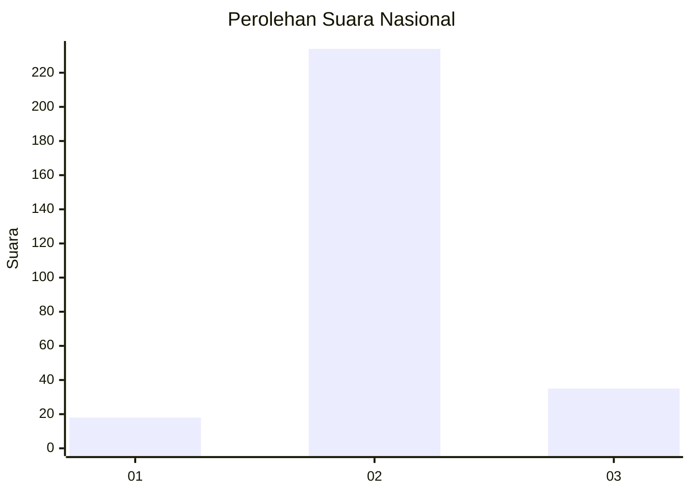
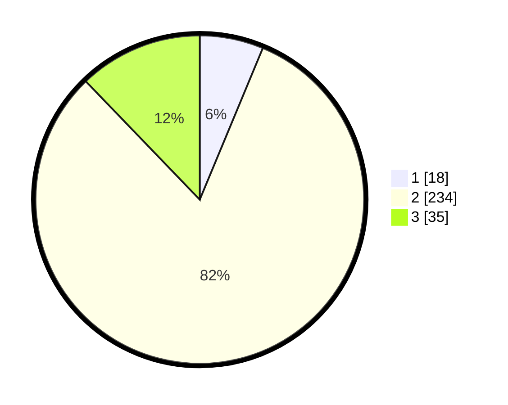

# Hasil

## Grafik

## Tabel

| No. | Nama Paslon    | Suara | Suara (raw) | Persentase |
|:--- |:-------------- | -----:| -----------:| ----------:|
| 1   | ANIES MUHAIMIN | 18    | [18][p-1]   | 6,27       |
| 2   | PRABOWO GIBRAN | 234   | [234][p-2]  | 81,53      |
| 3   | GANJAR MAHFUD  | 35    | [35][p-3]   | 12,20      |

[p-1]: https://github.com/gigit-pemilu/pemilu-2024/blob/main/pilpres/hitung-suara/sub/92-papua-barat/sub/06-teluk-bintuni/sub/16-aroba/sub/2003-sido-makmur/sub/001-tps/sub/paslon-1.txt
[p-2]: https://github.com/gigit-pemilu/pemilu-2024/blob/main/pilpres/hitung-suara/sub/92-papua-barat/sub/06-teluk-bintuni/sub/16-aroba/sub/2003-sido-makmur/sub/001-tps/sub/paslon-2.txt
[p-3]: https://github.com/gigit-pemilu/pemilu-2024/blob/main/pilpres/hitung-suara/sub/92-papua-barat/sub/06-teluk-bintuni/sub/16-aroba/sub/2003-sido-makmur/sub/001-tps/sub/paslon-3.txt

## Foto C Plano

https://sirekap-obj-formc.kpu.go.id/c8cd/pemilu/ppwp/92/06/16/20/03/9206162003001-20240215-003316--98c2a477-70f4-468e-9c7a-61e44b1b9041.jpg

https://sirekap-obj-formc.kpu.go.id/c8cd/pemilu/ppwp/92/06/16/20/03/9206162003001-20240215-003533--20c144c1-a4e2-4696-bbaf-b1be3c73c750.jpg

https://sirekap-obj-formc.kpu.go.id/c8cd/pemilu/ppwp/92/06/16/20/03/9206162003001-20240215-003635--b1a6f4b4-53c4-4cbc-ae88-d7061d780c49.jpg

## Metadata

| Key        | Value               |
| ---------- | ------------------- |
| Time Stamp | 2024-02-25 16:00:00 |

