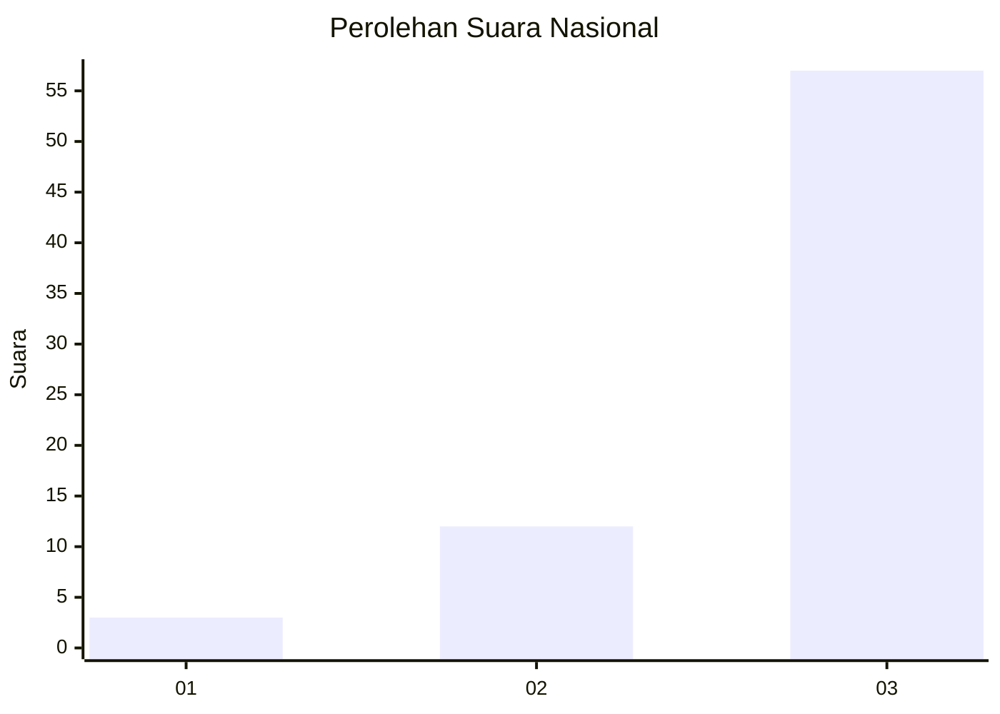
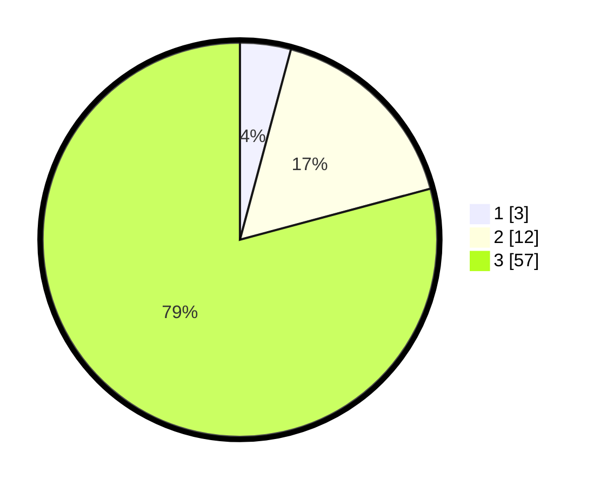

# Hasil

## Grafik

## Tabel

| No. | Nama Paslon    | Suara | Suara (raw) | Persentase |
|:--- |:-------------- | -----:| -----------:| ----------:|
| 1   | ANIES MUHAIMIN | 3     | [3][p-1]    | 4,17       |
| 2   | PRABOWO GIBRAN | 12    | [12][p-2]   | 16,67      |
| 3   | GANJAR MAHFUD  | 57    | [57][p-3]   | 79,17      |

[p-1]: https://github.com/gigit-pemilu/pemilu-2024/blob/main/pilpres/hitung-suara/sub/92-papua-barat/sub/07-teluk-wondama/sub/07-naikere/sub/2001-wosimi/sub/001-tps/sub/paslon-1.txt
[p-2]: https://github.com/gigit-pemilu/pemilu-2024/blob/main/pilpres/hitung-suara/sub/92-papua-barat/sub/07-teluk-wondama/sub/07-naikere/sub/2001-wosimi/sub/001-tps/sub/paslon-2.txt
[p-3]: https://github.com/gigit-pemilu/pemilu-2024/blob/main/pilpres/hitung-suara/sub/92-papua-barat/sub/07-teluk-wondama/sub/07-naikere/sub/2001-wosimi/sub/001-tps/sub/paslon-3.txt

## Foto C Plano

https://sirekap-obj-formc.kpu.go.id/f9fd/pemilu/ppwp/92/07/07/20/01/9207072001001-20240214-155031--91a83c55-4ea8-477c-b1b7-10375ffb750b.jpg

https://sirekap-obj-formc.kpu.go.id/f9fd/pemilu/ppwp/92/07/07/20/01/9207072001001-20240214-155053--3921e39e-40d2-4859-9d02-931bdede9ffb.jpg

## Metadata

| Key        | Value               |
| ---------- | ------------------- |
| Time Stamp | 2024-02-15 07:00:44 |

