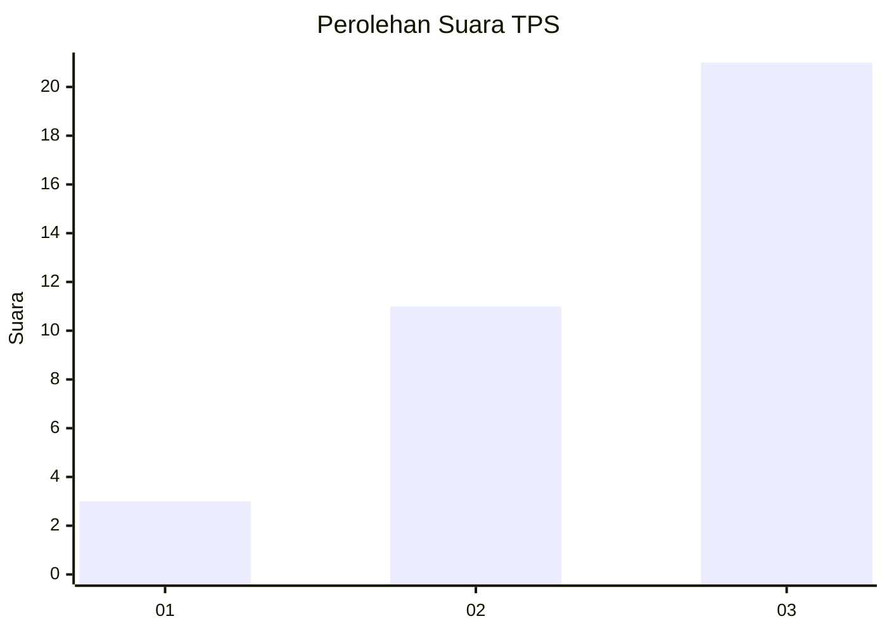
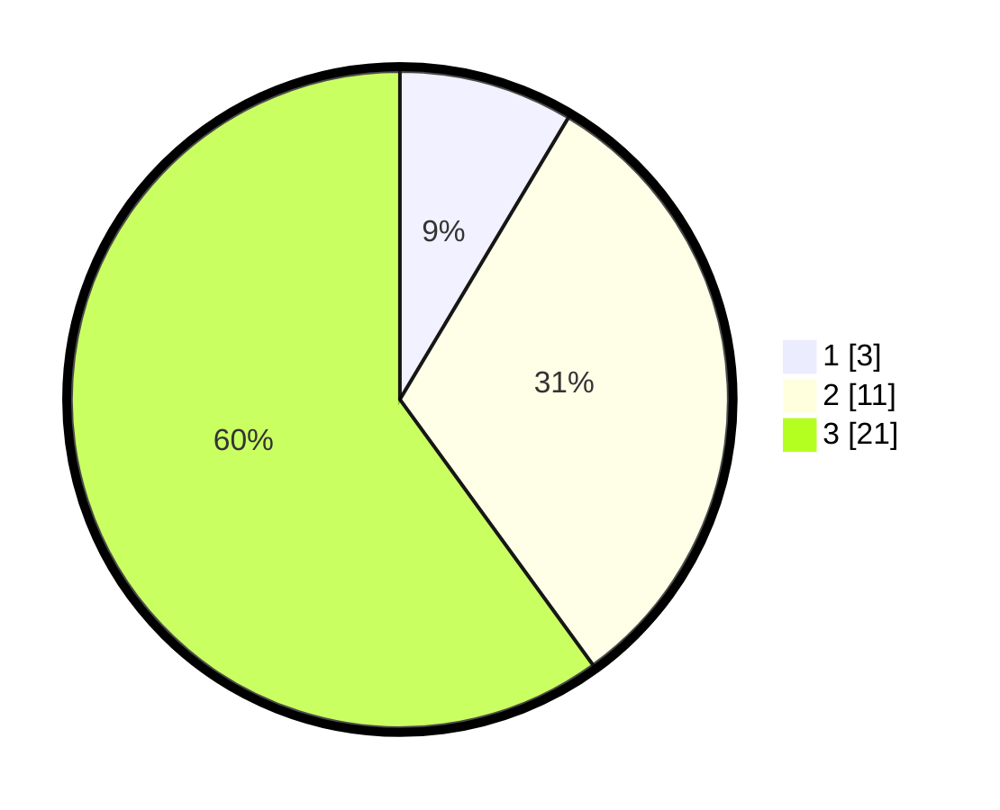

# Hasil

## Grafik

## Tabel

| No. | Nama Paslon    | Suara | Suara (raw) | Persentase |
|:--- |:-------------- | -----:| -----------:| ----------:|
| 1   | ANIES MUHAIMIN | 3     | [3][p-1]    | 8,57       |
| 2   | PRABOWO GIBRAN | 11    | [11][p-2]   | 31,43      |
| 3   | GANJAR MAHFUD  | 21    | [21][p-3]   | 60,00      |

[p-1]: https://github.com/gigit-pemilu/pemilu-2024-92-papua-barat/blob/main/pilpres/hitung-suara/sub/92-papua-barat/sub/07-teluk-wondama/sub/07-naikere/sub/2003-yabore/sub/001-tps/sub/paslon-1.txt
[p-2]: https://github.com/gigit-pemilu/pemilu-2024-92-papua-barat/blob/main/pilpres/hitung-suara/sub/92-papua-barat/sub/07-teluk-wondama/sub/07-naikere/sub/2003-yabore/sub/001-tps/sub/paslon-2.txt
[p-3]: https://github.com/gigit-pemilu/pemilu-2024-92-papua-barat/blob/main/pilpres/hitung-suara/sub/92-papua-barat/sub/07-teluk-wondama/sub/07-naikere/sub/2003-yabore/sub/001-tps/sub/paslon-3.txt

## Foto C Plano

https://sirekap-obj-formc.kpu.go.id/a1a5/pemilu/ppwp/92/07/07/20/03/9207072003001-20240214-132603--77b43a88-0010-4013-a7e3-4b1b535f26bb.jpg

https://sirekap-obj-formc.kpu.go.id/a1a5/pemilu/ppwp/92/07/07/20/03/9207072003001-20240214-132210--5f1ab725-448c-4fde-978e-87a6a5de7b1d.jpg

https://sirekap-obj-formc.kpu.go.id/a1a5/pemilu/ppwp/92/07/07/20/03/9207072003001-20240214-131806--454afa94-ce2d-4a0e-9845-0b17fc611dd2.jpg

## Metadata

| Key        | Value               |
| ---------- | ------------------- |
| Time Stamp | 2024-02-14 21:46:01 |

## DATA PEMILIH TETAP

Jumlah pemilih dalam DPT: **35**.
 * L: **20**.
 * P: **15**.

## DATA PENGGUNA HAK PILIH

Jumlah pengguna hak pilih dalam DPT: **26**.
 * L: **15**.
 * P: **11**.

Jumlah pengguna hak pilih dalam DPTb: **8**.
 * L: **4**.
 * P: **4**.

Jumlah pengguna hak pilih dalam DPK: **1**.
 * L: **1**.
 * P: **0**.

Jumlah pengguna hak pilih: **35**.
 * L: **20**.
 * P: **15**.

## JUMLAH SUARA SAH DAN TIDAK SAH

JUMLAH SELURUH SUARA SAH: **35**.

JUMLAH SUARA TIDAK SAH: **0**.

JUMLAH SELURUH SUARA SAH DAN SUARA TIDAK SAH: **35**.

