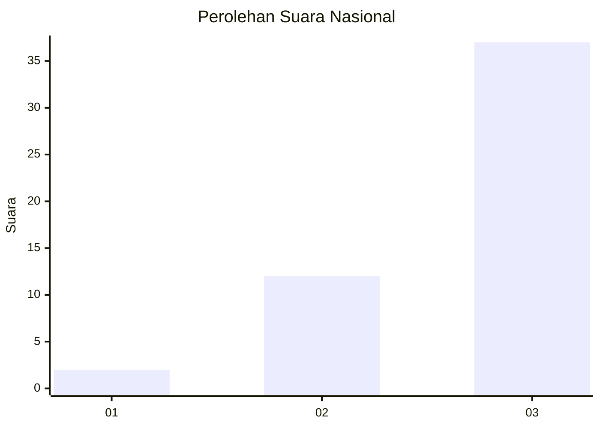
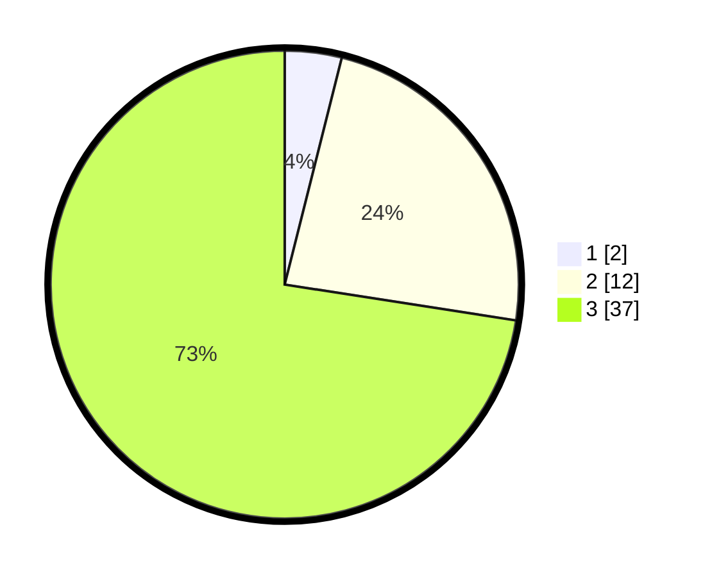

# Hasil

## Grafik

## Tabel

| No. | Nama Paslon    | Suara | Suara (raw) | Persentase |
|:--- |:-------------- | -----:| -----------:| ----------:|
| 1   | ANIES MUHAIMIN | 2     | [2][p-1]    | 3,92       |
| 2   | PRABOWO GIBRAN | 12    | [12][p-2]   | 23,53      |
| 3   | GANJAR MAHFUD  | 37    | [37][p-3]   | 72,55      |

[p-1]: https://github.com/gigit-pemilu/pemilu-2024/blob/main/pilpres/hitung-suara/sub/92-papua-barat/sub/07-teluk-wondama/sub/13-soug-jaya/sub/2002-yarmatum/sub/001-tps/sub/paslon-1.txt
[p-2]: https://github.com/gigit-pemilu/pemilu-2024/blob/main/pilpres/hitung-suara/sub/92-papua-barat/sub/07-teluk-wondama/sub/13-soug-jaya/sub/2002-yarmatum/sub/001-tps/sub/paslon-2.txt
[p-3]: https://github.com/gigit-pemilu/pemilu-2024/blob/main/pilpres/hitung-suara/sub/92-papua-barat/sub/07-teluk-wondama/sub/13-soug-jaya/sub/2002-yarmatum/sub/001-tps/sub/paslon-3.txt

## Foto C Plano

https://sirekap-obj-formc.kpu.go.id/198b/pemilu/ppwp/92/07/13/20/02/9207132002001-20240215-091207--b0edeef0-29f5-4174-9580-c3b9c8d066c0.jpg

https://sirekap-obj-formc.kpu.go.id/198b/pemilu/ppwp/92/07/13/20/02/9207132002001-20240214-190420--09b3d139-9287-4151-b254-e80f4f342c80.jpg

https://sirekap-obj-formc.kpu.go.id/198b/pemilu/ppwp/92/07/13/20/02/9207132002001-20240214-190708--fe924d3c-9297-4f9f-ad7a-7150b2b5eda7.jpg

## Metadata

| Key        | Value               |
| ---------- | ------------------- |
| Time Stamp | 2024-02-16 12:51:22 |

## DATA PEMILIH TETAP

Jumlah pemilih dalam DPT: **54**.
 * L: **26**.
 * P: **28**.

## DATA PENGGUNA HAK PILIH

Jumlah pengguna hak pilih dalam DPT: **50**.
 * L: **25**.
 * P: **25**.

Jumlah pengguna hak pilih dalam DPTb: **2**.
 * L: **1**.
 * P: **1**.

Jumlah pengguna hak pilih dalam DPK: **0**.
 * L: **0**.
 * P: **0**.

Jumlah pengguna hak pilih: **52**.
 * L: **26**.
 * P: **26**.

## JUMLAH SUARA SAH DAN TIDAK SAH

JUMLAH SELURUH SUARA SAH: **51**.

JUMLAH SUARA TIDAK SAH: **1**.

JUMLAH SELURUH SUARA SAH DAN SUARA TIDAK SAH: **52**.

