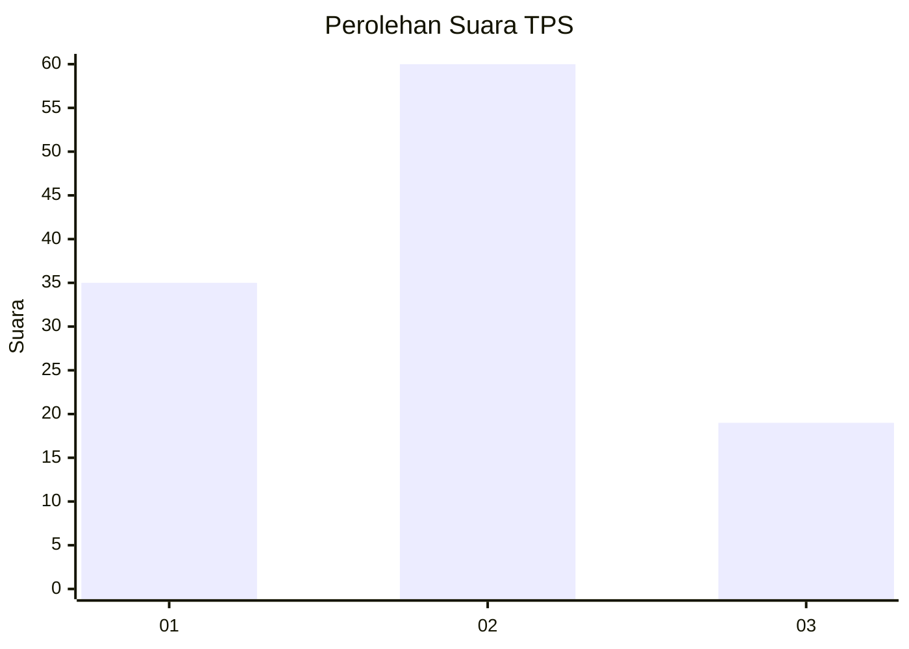
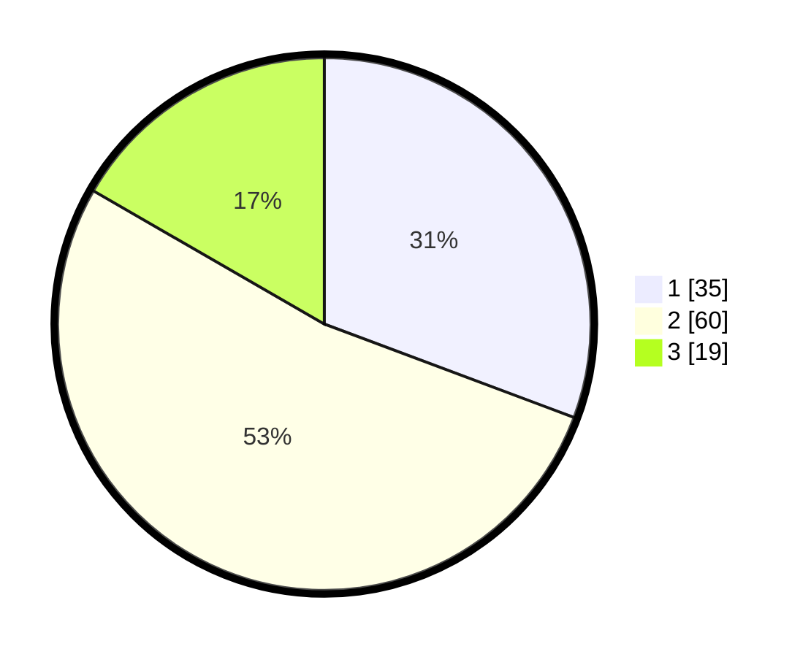

# Hasil

## Grafik

## Tabel

| No. | Nama Paslon    | Suara | Suara (raw) | Persentase |
|:--- |:-------------- | -----:| -----------:| ----------:|
| 1   | ANIES MUHAIMIN | 35    | [35][p-1]   | 30,70      |
| 2   | PRABOWO GIBRAN | 60    | [60][p-2]   | 52,63      |
| 3   | GANJAR MAHFUD  | 19    | [19][p-3]   | 16,67      |

[p-1]: https://github.com/gigit-pemilu/pemilu-2024-92-papua-barat/blob/main/pilpres/hitung-suara/sub/92-papua-barat/sub/08-kaimana/sub/01-kaimana/sub/1001-kaimana-kota/sub/001-tps/sub/paslon-1.txt
[p-2]: https://github.com/gigit-pemilu/pemilu-2024-92-papua-barat/blob/main/pilpres/hitung-suara/sub/92-papua-barat/sub/08-kaimana/sub/01-kaimana/sub/1001-kaimana-kota/sub/001-tps/sub/paslon-2.txt
[p-3]: https://github.com/gigit-pemilu/pemilu-2024-92-papua-barat/blob/main/pilpres/hitung-suara/sub/92-papua-barat/sub/08-kaimana/sub/01-kaimana/sub/1001-kaimana-kota/sub/001-tps/sub/paslon-3.txt

## Foto C Plano

https://sirekap-obj-formc.kpu.go.id/0d9e/pemilu/ppwp/92/08/01/10/01/9208011001001-20240215-053312--a1573048-1883-41de-ad14-8c5b93490b52.jpg

https://sirekap-obj-formc.kpu.go.id/0d9e/pemilu/ppwp/92/08/01/10/01/9208011001001-20240215-053410--850d8ef3-3d94-481c-b41e-cd3a8478f8ca.jpg

https://sirekap-obj-formc.kpu.go.id/0d9e/pemilu/ppwp/92/08/01/10/01/9208011001001-20240215-053631--5e859f52-27b7-4e4d-ae83-8fe4df5b83e2.jpg

## Metadata

| Key        | Value               |
| ---------- | ------------------- |
| Time Stamp | 2024-02-24 22:31:28 |

