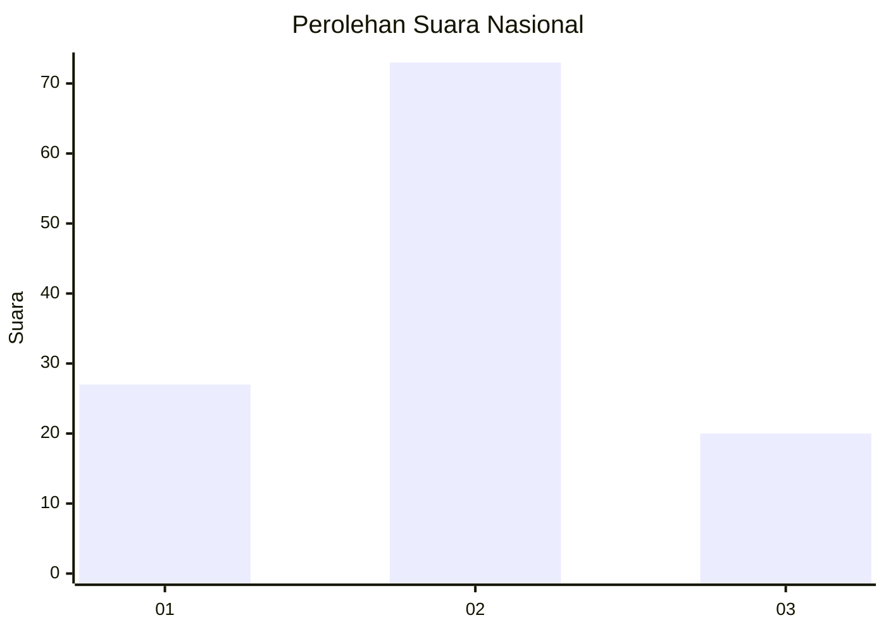
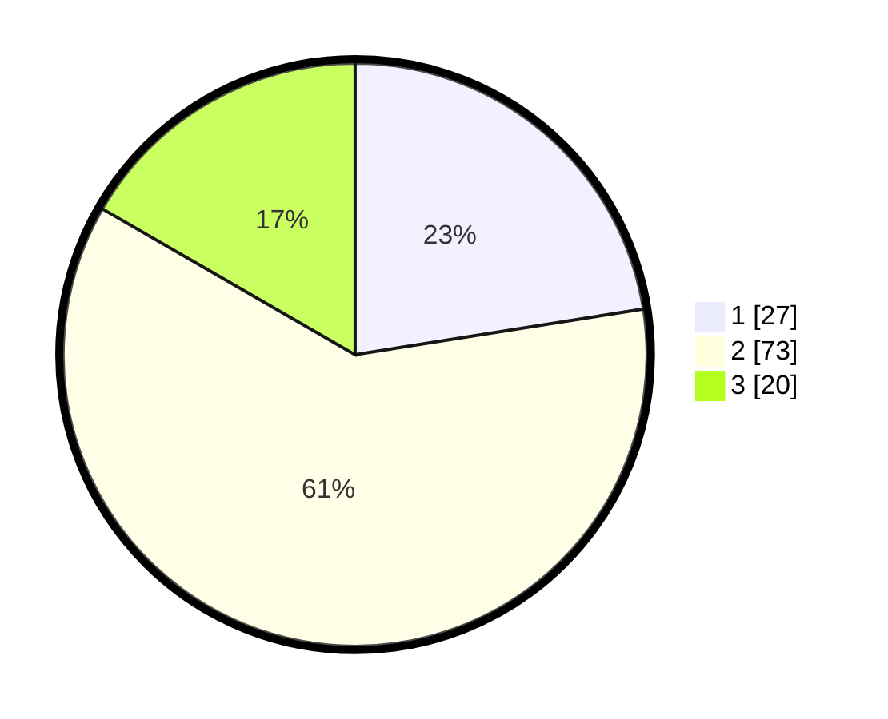

# Hasil

## Grafik

## Tabel

| No. | Nama Paslon    | Suara | Suara (raw) | Persentase |
|:--- |:-------------- | -----:| -----------:| ----------:|
| 1   | ANIES MUHAIMIN | 27    | [27][p-1]   | 22,50      |
| 2   | PRABOWO GIBRAN | 73    | [73][p-2]   | 60,83      |
| 3   | GANJAR MAHFUD  | 20    | [20][p-3]   | 16,67      |

[p-1]: https://github.com/gigit-pemilu/pemilu-2024/blob/main/pilpres/hitung-suara/sub/92-papua-barat/sub/08-kaimana/sub/01-kaimana/sub/1001-kaimana-kota/sub/002-tps/sub/paslon-1.txt
[p-2]: https://github.com/gigit-pemilu/pemilu-2024/blob/main/pilpres/hitung-suara/sub/92-papua-barat/sub/08-kaimana/sub/01-kaimana/sub/1001-kaimana-kota/sub/002-tps/sub/paslon-2.txt
[p-3]: https://github.com/gigit-pemilu/pemilu-2024/blob/main/pilpres/hitung-suara/sub/92-papua-barat/sub/08-kaimana/sub/01-kaimana/sub/1001-kaimana-kota/sub/002-tps/sub/paslon-3.txt

## Foto C Plano

https://sirekap-obj-formc.kpu.go.id/3c54/pemilu/ppwp/92/08/01/10/01/9208011001002-20240214-210707--5702e757-95c7-4f35-bb30-4b8e388fcb96.jpg

https://sirekap-obj-formc.kpu.go.id/3c54/pemilu/ppwp/92/08/01/10/01/9208011001002-20240214-210623--fe56b140-601c-439e-a9ef-5688c1141013.jpg

https://sirekap-obj-formc.kpu.go.id/3c54/pemilu/ppwp/92/08/01/10/01/9208011001002-20240214-210843--bf3886db-37ac-42b9-9508-e4d83deafadb.jpg

## Metadata

| Key        | Value               |
| ---------- | ------------------- |
| Time Stamp | 2024-02-25 21:00:00 |

