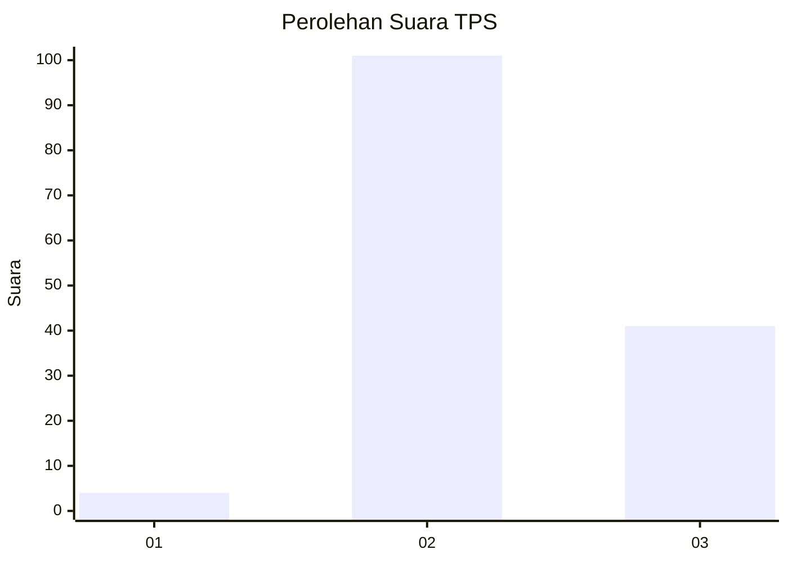
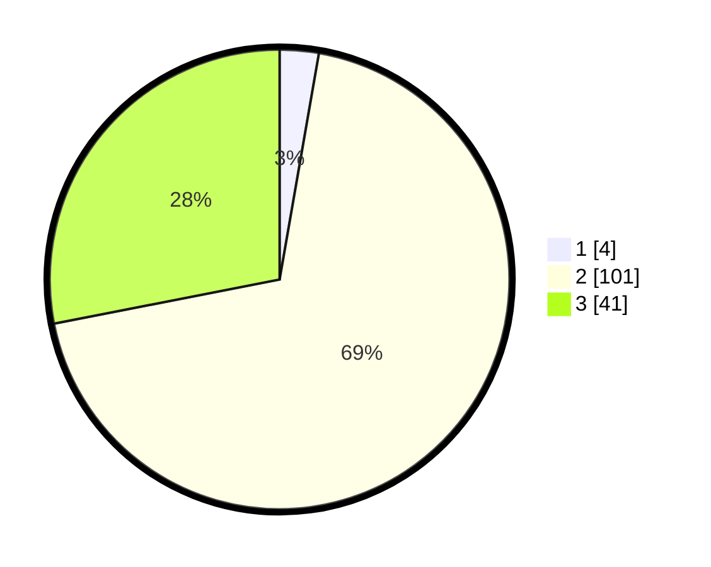

# Hasil

## Grafik

## Tabel

| No. | Nama Paslon    | Suara | Suara (raw) | Persentase |
|:--- |:-------------- | -----:| -----------:| ----------:|
| 1   | ANIES MUHAIMIN | 4     | [4][p-1]    | 2,74       |
| 2   | PRABOWO GIBRAN | 101   | [101][p-2]  | 69,18      |
| 3   | GANJAR MAHFUD  | 41    | [41][p-3]   | 28,08      |

[p-1]: https://github.com/gigit-pemilu/pemilu-2024-92-papua-barat/blob/main/pilpres/hitung-suara/sub/92-papua-barat/sub/08-kaimana/sub/01-kaimana/sub/1001-kaimana-kota/sub/022-tps/sub/paslon-1.txt
[p-2]: https://github.com/gigit-pemilu/pemilu-2024-92-papua-barat/blob/main/pilpres/hitung-suara/sub/92-papua-barat/sub/08-kaimana/sub/01-kaimana/sub/1001-kaimana-kota/sub/022-tps/sub/paslon-2.txt
[p-3]: https://github.com/gigit-pemilu/pemilu-2024-92-papua-barat/blob/main/pilpres/hitung-suara/sub/92-papua-barat/sub/08-kaimana/sub/01-kaimana/sub/1001-kaimana-kota/sub/022-tps/sub/paslon-3.txt

## Foto C Plano

https://sirekap-obj-formc.kpu.go.id/6e07/pemilu/ppwp/92/08/01/10/01/9208011001022-20240215-031526--a72b4e75-65cb-4bd7-9819-7685cd01339c.jpg

https://sirekap-obj-formc.kpu.go.id/6e07/pemilu/ppwp/92/08/01/10/01/9208011001022-20240215-003227--d639fb44-285a-4dda-b5b9-c4c10b79cb11.jpg

https://sirekap-obj-formc.kpu.go.id/6e07/pemilu/ppwp/92/08/01/10/01/9208011001022-20240215-024801--e78d50e4-2d4b-4ac0-a649-d6aefde60bab.jpg

## Metadata

| Key        | Value               |
| ---------- | ------------------- |
| Time Stamp | 2024-02-15 12:00:28 |

