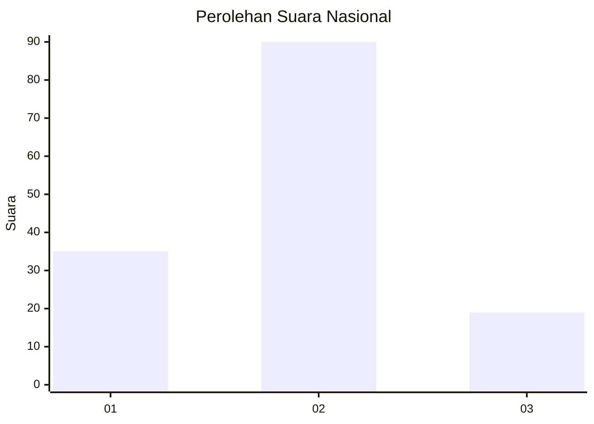
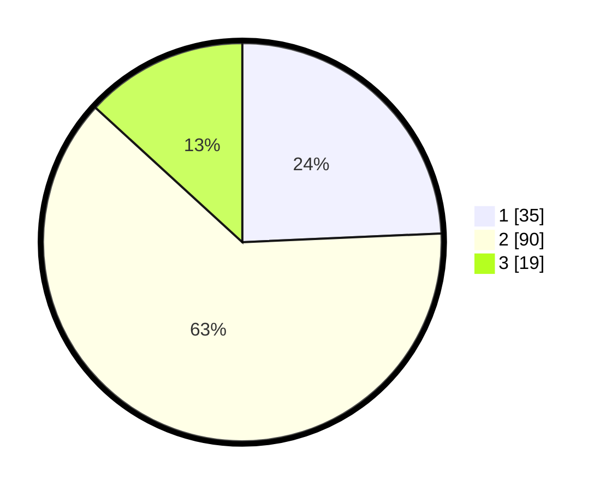

# Hasil

## Grafik

## Tabel

| No. | Nama Paslon    | Suara | Suara (raw) | Persentase |
|:--- |:-------------- | -----:| -----------:| ----------:|
| 1   | ANIES MUHAIMIN | 35    | [35][p-1]   | 24,31      |
| 2   | PRABOWO GIBRAN | 90    | [90][p-2]   | 62,50      |
| 3   | GANJAR MAHFUD  | 19    | [19][p-3]   | 13,19      |

[p-1]: https://github.com/gigit-pemilu/pemilu-2024/blob/main/pilpres/hitung-suara/sub/92-papua-barat/sub/08-kaimana/sub/01-kaimana/sub/1001-kaimana-kota/sub/027-tps/sub/paslon-1.txt
[p-2]: https://github.com/gigit-pemilu/pemilu-2024/blob/main/pilpres/hitung-suara/sub/92-papua-barat/sub/08-kaimana/sub/01-kaimana/sub/1001-kaimana-kota/sub/027-tps/sub/paslon-2.txt
[p-3]: https://github.com/gigit-pemilu/pemilu-2024/blob/main/pilpres/hitung-suara/sub/92-papua-barat/sub/08-kaimana/sub/01-kaimana/sub/1001-kaimana-kota/sub/027-tps/sub/paslon-3.txt

## Foto C Plano

https://sirekap-obj-formc.kpu.go.id/a9a7/pemilu/ppwp/92/08/01/10/01/9208011001027-20240214-141211--b67f4bd6-8193-4e12-b9be-c0232b29f3cc.jpg

https://sirekap-obj-formc.kpu.go.id/a9a7/pemilu/ppwp/92/08/01/10/01/9208011001027-20240214-141301--74e1ead2-8720-4fb1-be28-f013af860eec.jpg

https://sirekap-obj-formc.kpu.go.id/a9a7/pemilu/ppwp/92/08/01/10/01/9208011001027-20240214-141532--c8d7c553-ad3d-43a8-8298-c4fff5749d37.jpg

## Metadata

| Key        | Value               |
| ---------- | ------------------- |
| Time Stamp | 2024-02-25 02:00:00 |

