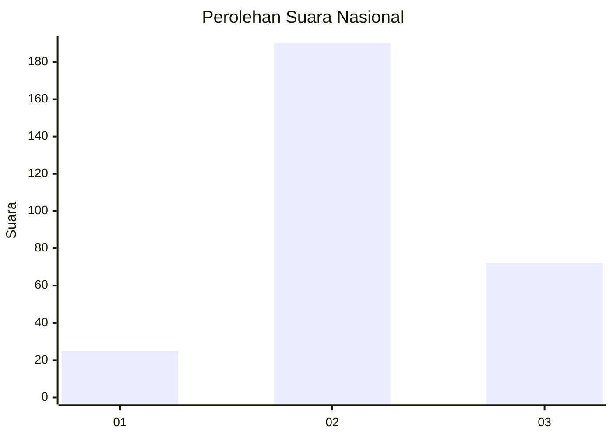
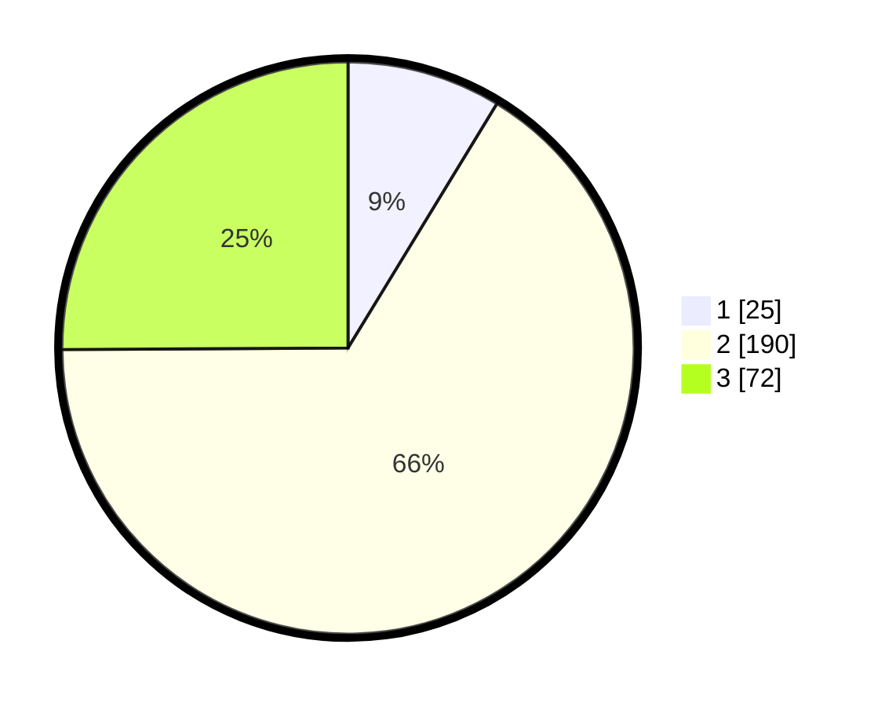

# Hasil

## Grafik

## Tabel

| No. | Nama Paslon    | Suara | Suara (raw) | Persentase |
|:--- |:-------------- | -----:| -----------:| ----------:|
| 1   | ANIES MUHAIMIN | 25    | [25][p-1]   | 8,71       |
| 2   | PRABOWO GIBRAN | 190   | [190][p-2]  | 66,20      |
| 3   | GANJAR MAHFUD  | 72    | [72][p-3]   | 25,09      |

[p-1]: https://github.com/gigit-pemilu/pemilu-2024/blob/main/pilpres/hitung-suara/sub/92-papua-barat/sub/11-manokwari-selatan/sub/01-ransiki/sub/2001-ransiki/sub/003-tps/sub/paslon-1.txt
[p-2]: https://github.com/gigit-pemilu/pemilu-2024/blob/main/pilpres/hitung-suara/sub/92-papua-barat/sub/11-manokwari-selatan/sub/01-ransiki/sub/2001-ransiki/sub/003-tps/sub/paslon-2.txt
[p-3]: https://github.com/gigit-pemilu/pemilu-2024/blob/main/pilpres/hitung-suara/sub/92-papua-barat/sub/11-manokwari-selatan/sub/01-ransiki/sub/2001-ransiki/sub/003-tps/sub/paslon-3.txt

## Foto C Plano

https://sirekap-obj-formc.kpu.go.id/6b0e/pemilu/ppwp/92/11/01/20/01/9211012001003-20240313-204836--a7d1c0eb-e0d2-4805-8030-4ffdf8dcc1ff.jpg

https://sirekap-obj-formc.kpu.go.id/6b0e/pemilu/ppwp/92/11/01/20/01/9211012001003-20240313-205258--87e55af9-adcc-4a08-b7d8-c1a8559544b1.jpg

https://sirekap-obj-formc.kpu.go.id/6b0e/pemilu/ppwp/92/11/01/20/01/9211012001003-20240313-205448--7c9f7f83-e696-4a55-8963-7c97b43892a2.jpg

## Metadata

| Key        | Value               |
| ---------- | ------------------- |
| Time Stamp | 2024-03-13 21:00:00 |

## DATA PEMILIH TETAP

Jumlah pemilih dalam DPT: **284**.
 * L: **148**.
 * P: **136**.

## DATA PENGGUNA HAK PILIH

Jumlah pengguna hak pilih dalam DPT: **284**.
 * L: **148**.
 * P: **136**.

Jumlah pengguna hak pilih dalam DPTb: **0**.
 * L: **0**.
 * P: **0**.

Jumlah pengguna hak pilih dalam DPK: **6**.
 * L: **3**.
 * P: **3**.

Jumlah pengguna hak pilih: **290**.
 * L: **151**.
 * P: **139**.

## JUMLAH SUARA SAH DAN TIDAK SAH

JUMLAH SELURUH SUARA SAH: **287**.

JUMLAH SUARA TIDAK SAH: **3**.

JUMLAH SELURUH SUARA SAH DAN SUARA TIDAK SAH: **290**.

