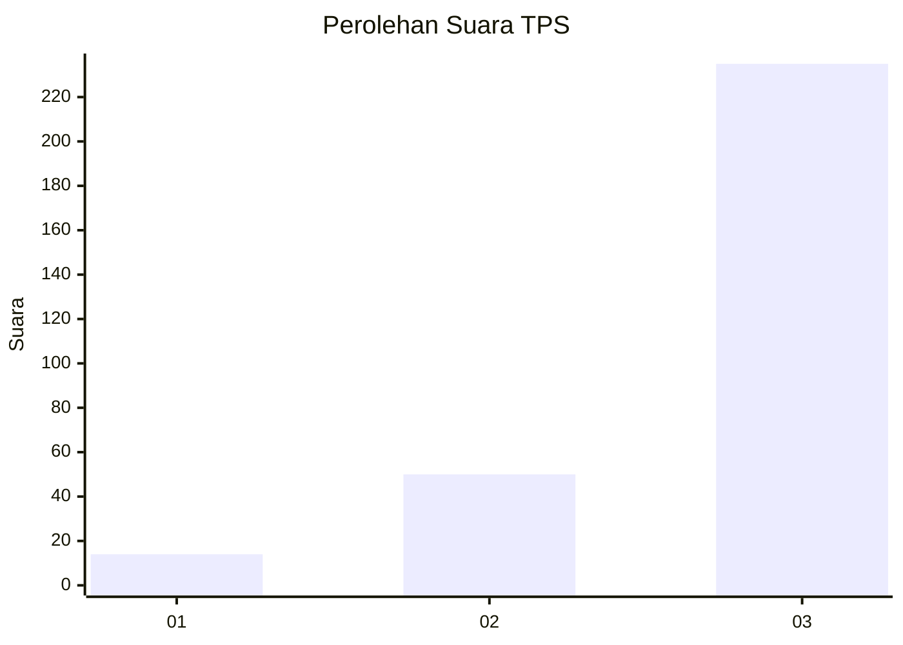
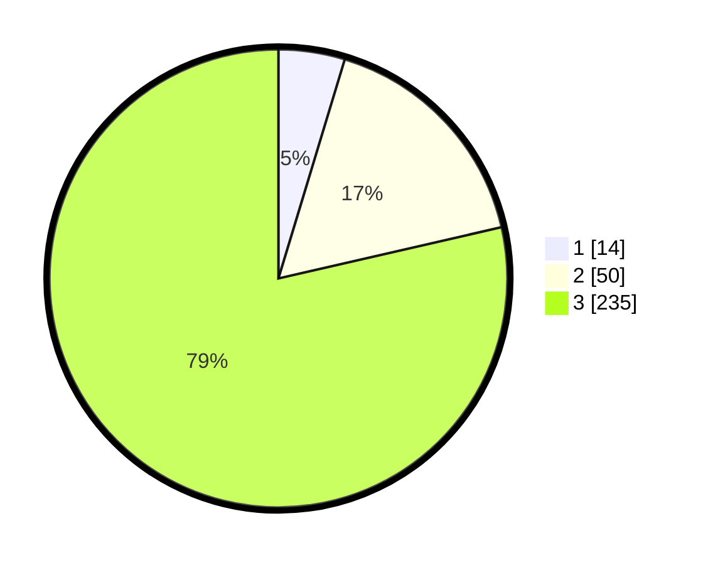

# Hasil

## Grafik

## Tabel

| No. | Nama Paslon    | Suara | Suara (raw) | Persentase |
|:--- |:-------------- | -----:| -----------:| ----------:|
| 1   | ANIES MUHAIMIN | 14    | [14][p-1]   | 4,68       |
| 2   | PRABOWO GIBRAN | 50    | [50][p-2]   | 16,72      |
| 3   | GANJAR MAHFUD  | 235   | [235][p-3]  | 78,60      |

[p-1]: https://github.com/gigit-pemilu/pemilu-2024-92-papua-barat/blob/main/pilpres/hitung-suara/sub/92-papua-barat/sub/11-manokwari-selatan/sub/01-ransiki/sub/2005-sabri/sub/002-tps/sub/paslon-1.txt
[p-2]: https://github.com/gigit-pemilu/pemilu-2024-92-papua-barat/blob/main/pilpres/hitung-suara/sub/92-papua-barat/sub/11-manokwari-selatan/sub/01-ransiki/sub/2005-sabri/sub/002-tps/sub/paslon-2.txt
[p-3]: https://github.com/gigit-pemilu/pemilu-2024-92-papua-barat/blob/main/pilpres/hitung-suara/sub/92-papua-barat/sub/11-manokwari-selatan/sub/01-ransiki/sub/2005-sabri/sub/002-tps/sub/paslon-3.txt

## Foto C Plano

https://sirekap-obj-formc.kpu.go.id/b11a/pemilu/ppwp/92/11/01/20/05/9211012005002-20240314-211159--85f8ce9b-26ca-4838-8ada-072d81e032b7.jpg

https://sirekap-obj-formc.kpu.go.id/b11a/pemilu/ppwp/92/11/01/20/05/9211012005002-20240314-212907--66dc4db6-49bc-4802-8c5e-0e2902ce7360.jpg

https://sirekap-obj-formc.kpu.go.id/b11a/pemilu/ppwp/92/11/01/20/05/9211012005002-20240314-213031--8a6390ba-3900-4532-9ef7-f58d8ab92bb8.jpg

## Metadata

| Key        | Value               |
| ---------- | ------------------- |
| Time Stamp | 2024-03-14 22:00:00 |

## DATA PEMILIH TETAP

Jumlah pemilih dalam DPT: **297**.
 * L: **136**.
 * P: **161**.

## DATA PENGGUNA HAK PILIH

Jumlah pengguna hak pilih dalam DPT: **297**.
 * L: **136**.
 * P: **161**.

Jumlah pengguna hak pilih dalam DPTb: **0**.
 * L: **0**.
 * P: **0**.

Jumlah pengguna hak pilih dalam DPK: **6**.
 * L: **2**.
 * P: **4**.

Jumlah pengguna hak pilih: **303**.
 * L: **138**.
 * P: **165**.

## JUMLAH SUARA SAH DAN TIDAK SAH

JUMLAH SELURUH SUARA SAH: **299**.

JUMLAH SUARA TIDAK SAH: **4**.

JUMLAH SELURUH SUARA SAH DAN SUARA TIDAK SAH: **303**.

