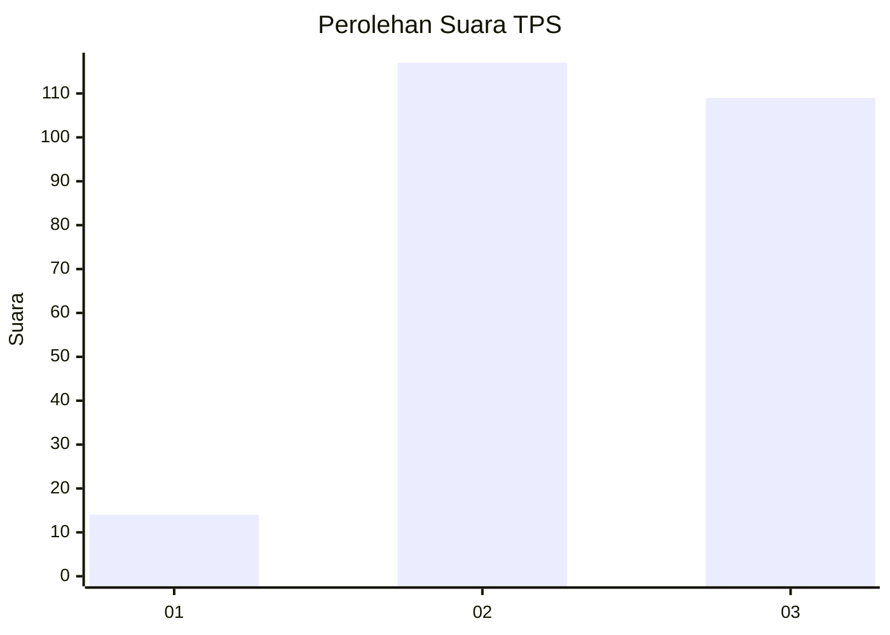
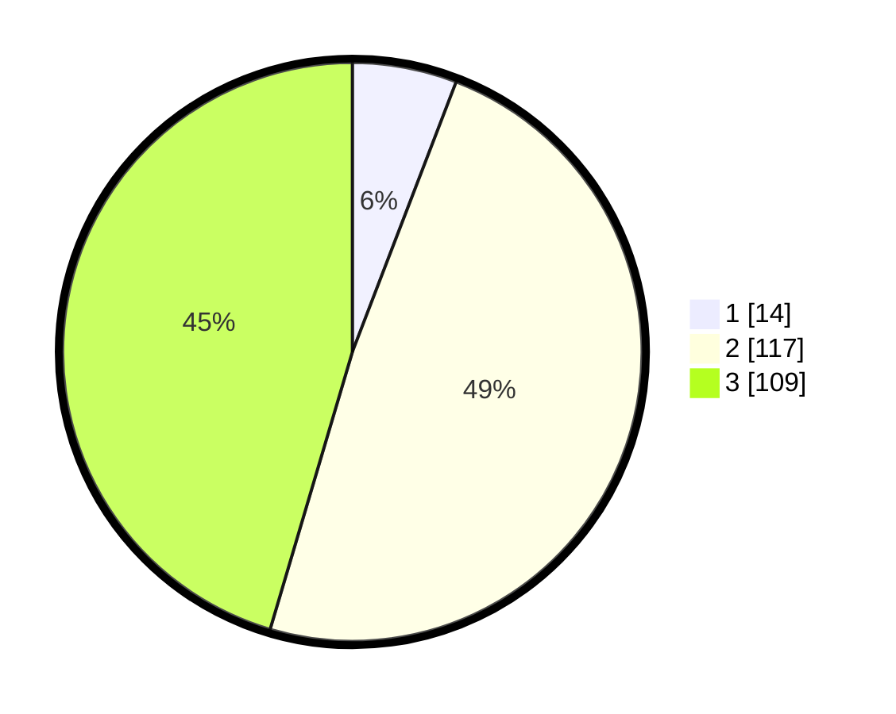

# Hasil

## Grafik

## Tabel

| No. | Nama Paslon    | Suara | Suara (raw) | Persentase |
|:--- |:-------------- | -----:| -----------:| ----------:|
| 1   | ANIES MUHAIMIN | 14    | [14][p-1]   | 5,83       |
| 2   | PRABOWO GIBRAN | 117   | [117][p-2]  | 48,75      |
| 3   | GANJAR MAHFUD  | 109   | [109][p-3]  | 45,42      |

[p-1]: https://github.com/gigit-pemilu/pemilu-2024-92-papua-barat/blob/main/pilpres/hitung-suara/sub/92-papua-barat/sub/11-manokwari-selatan/sub/02-oransbari/sub/2003-waroser/sub/001-tps/sub/paslon-1.txt
[p-2]: https://github.com/gigit-pemilu/pemilu-2024-92-papua-barat/blob/main/pilpres/hitung-suara/sub/92-papua-barat/sub/11-manokwari-selatan/sub/02-oransbari/sub/2003-waroser/sub/001-tps/sub/paslon-2.txt
[p-3]: https://github.com/gigit-pemilu/pemilu-2024-92-papua-barat/blob/main/pilpres/hitung-suara/sub/92-papua-barat/sub/11-manokwari-selatan/sub/02-oransbari/sub/2003-waroser/sub/001-tps/sub/paslon-3.txt

## Foto C Plano

https://sirekap-obj-formc.kpu.go.id/e3d7/pemilu/ppwp/92/11/02/20/03/9211022003001-20240215-200831--3eb041dc-8bdf-490c-a37c-7b4adccf456e.jpg

https://sirekap-obj-formc.kpu.go.id/e3d7/pemilu/ppwp/92/11/02/20/03/9211022003001-20240215-201108--787a7f81-f1bd-4613-87dc-fbc8488ebf40.jpg

https://sirekap-obj-formc.kpu.go.id/e3d7/pemilu/ppwp/92/11/02/20/03/9211022003001-20240215-201525--e449c09d-71ff-4903-9d31-e28d2de0389e.jpg

## Metadata

| Key        | Value               |
| ---------- | ------------------- |
| Time Stamp | 2024-02-25 23:00:00 |

