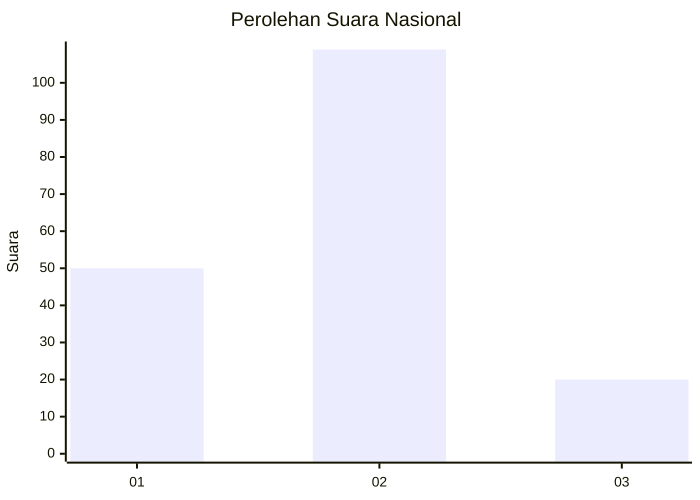
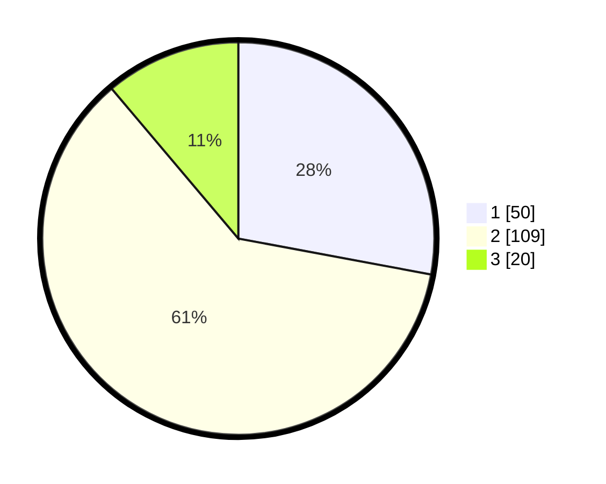

# Hasil

## Grafik

## Tabel

| No. | Nama Paslon    | Suara | Suara (raw) | Persentase |
|:--- |:-------------- | -----:| -----------:| ----------:|
| 1   | ANIES MUHAIMIN | 50    | [50][p-1]   | 27,93      |
| 2   | PRABOWO GIBRAN | 109   | [109][p-2]  | 60,89      |
| 3   | GANJAR MAHFUD  | 20    | [20][p-3]   | 11,17      |

[p-1]: https://github.com/gigit-pemilu/pemilu-2024/blob/main/pilpres/hitung-suara/sub/92-papua-barat/sub/11-manokwari-selatan/sub/02-oransbari/sub/2011-sindang-jaya/sub/001-tps/sub/paslon-1.txt
[p-2]: https://github.com/gigit-pemilu/pemilu-2024/blob/main/pilpres/hitung-suara/sub/92-papua-barat/sub/11-manokwari-selatan/sub/02-oransbari/sub/2011-sindang-jaya/sub/001-tps/sub/paslon-2.txt
[p-3]: https://github.com/gigit-pemilu/pemilu-2024/blob/main/pilpres/hitung-suara/sub/92-papua-barat/sub/11-manokwari-selatan/sub/02-oransbari/sub/2011-sindang-jaya/sub/001-tps/sub/paslon-3.txt

## Foto C Plano

https://sirekap-obj-formc.kpu.go.id/d33e/pemilu/ppwp/92/11/02/20/11/9211022011001-20240214-200721--618eedd6-7852-4653-aaac-2a2a21d8a2f4.jpg

https://sirekap-obj-formc.kpu.go.id/d33e/pemilu/ppwp/92/11/02/20/11/9211022011001-20240214-201456--693c8a4a-739c-4b18-965c-d43251c8971c.jpg

https://sirekap-obj-formc.kpu.go.id/d33e/pemilu/ppwp/92/11/02/20/11/9211022011001-20240214-191345--0a0f0db8-d1a7-4589-9350-79c67fa37ff3.jpg

## Metadata

| Key        | Value               |
| ---------- | ------------------- |
| Time Stamp | 2024-02-24 22:31:28 |

