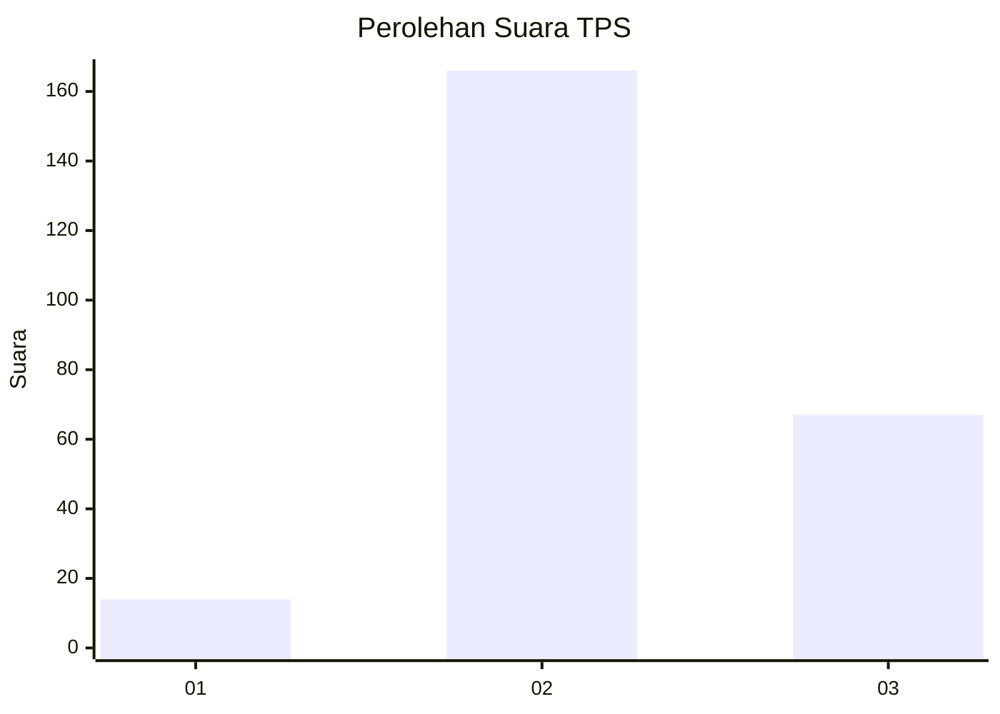

# Hasil

## Grafik

## Tabel

| No. | Nama Paslon    | Suara | Suara (raw) | Persentase |
|:--- |:-------------- | -----:| -----------:| ----------:|
| 1   | ANIES MUHAIMIN | 14    | [14][p-1]   | 5,67       |
| 2   | PRABOWO GIBRAN | 166   | [166][p-2]  | 67,21      |
| 3   | GANJAR MAHFUD  | 67    | [67][p-3]   | 27,13      |

[p-1]: https://github.com/gigit-pemilu/pemilu-2024-92-papua-barat/blob/main/pilpres/hitung-suara/sub/92-papua-barat/sub/11-manokwari-selatan/sub/05-momi-waren/sub/2001-dembek/sub/002-tps/sub/paslon-1.txt
[p-2]: https://github.com/gigit-pemilu/pemilu-2024-92-papua-barat/blob/main/pilpres/hitung-suara/sub/92-papua-barat/sub/11-manokwari-selatan/sub/05-momi-waren/sub/2001-dembek/sub/002-tps/sub/paslon-2.txt
[p-3]: https://github.com/gigit-pemilu/pemilu-2024-92-papua-barat/blob/main/pilpres/hitung-suara/sub/92-papua-barat/sub/11-manokwari-selatan/sub/05-momi-waren/sub/2001-dembek/sub/002-tps/sub/paslon-3.txt

## Foto C Plano

https://sirekap-obj-formc.kpu.go.id/2068/pemilu/ppwp/92/11/05/20/01/9211052001002-20240215-132358--faf92560-6cc0-4e11-a937-65041f7d9fcf.jpg

https://sirekap-obj-formc.kpu.go.id/2068/pemilu/ppwp/92/11/05/20/01/9211052001002-20240215-100820--ae4c4b82-5418-4b0d-8232-4bbc3a0e6882.jpg

https://sirekap-obj-formc.kpu.go.id/2068/pemilu/ppwp/92/11/05/20/01/9211052001002-20240215-101124--18499cb8-3c8d-417f-a502-6f95e2a82e92.jpg

## Metadata

| Key        | Value               |
| ---------- | ------------------- |
| Time Stamp | 2024-02-25 14:00:00 |

