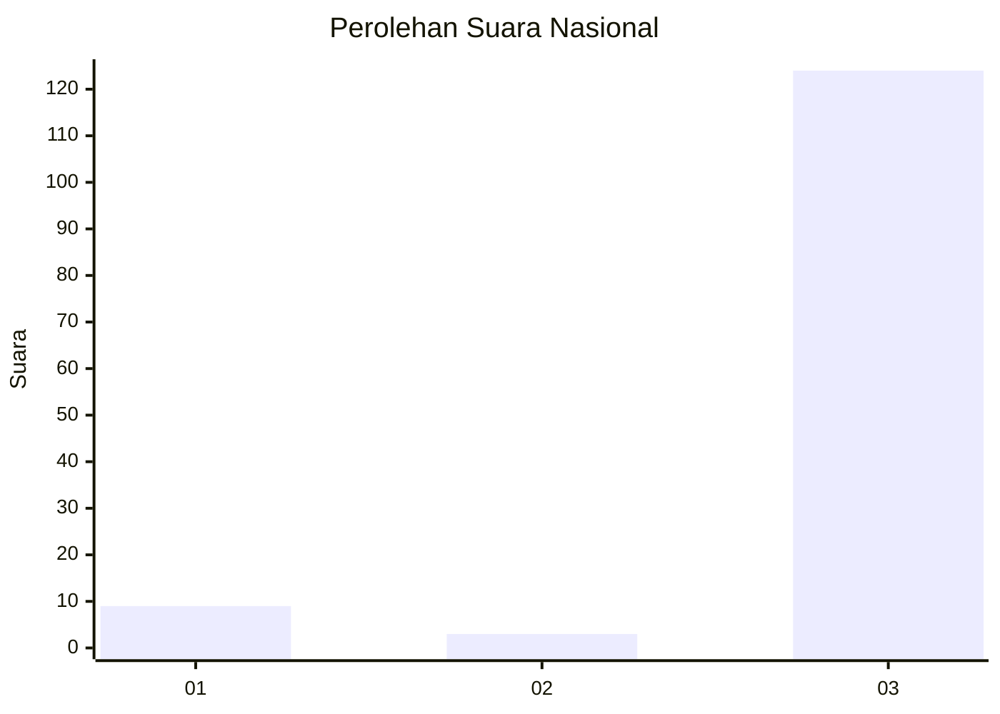
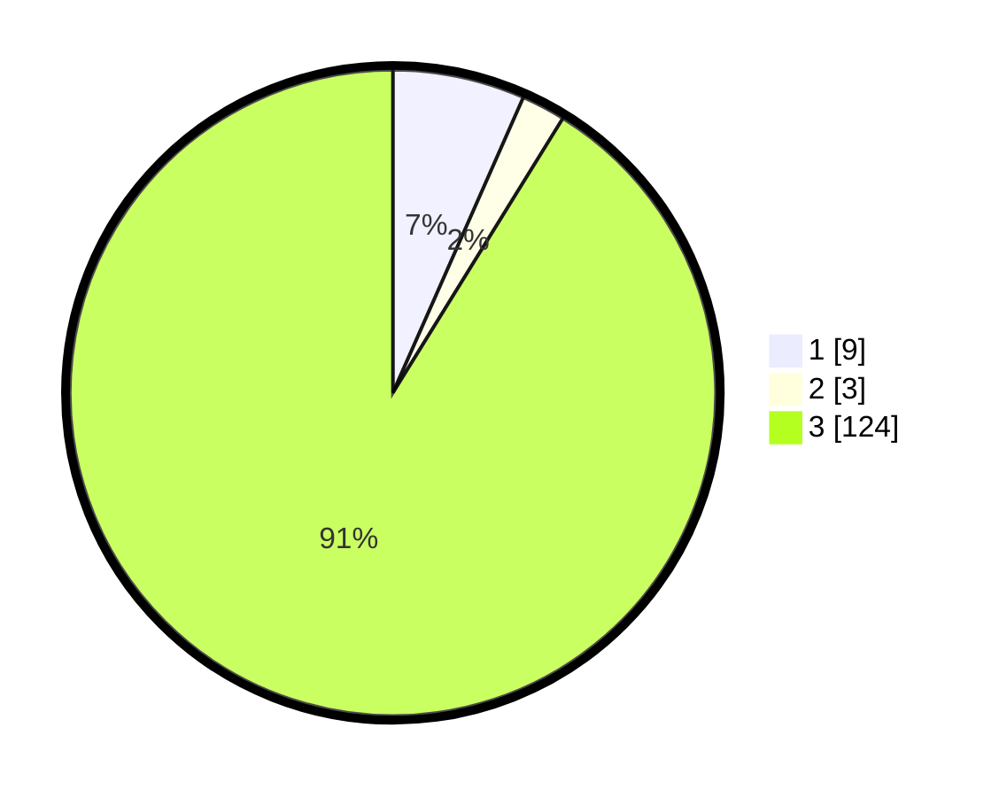

# Hasil

## Grafik

## Tabel

| No. | Nama Paslon    | Suara | Suara (raw) | Persentase |
|:--- |:-------------- | -----:| -----------:| ----------:|
| 1   | ANIES MUHAIMIN | 9     | [9][p-1]    | 6,62       |
| 2   | PRABOWO GIBRAN | 3     | [3][p-2]    | 2,21       |
| 3   | GANJAR MAHFUD  | 124   | [124][p-3]  | 91,18      |

[p-1]: https://github.com/gigit-pemilu/pemilu-2024/blob/main/pilpres/hitung-suara/sub/92-papua-barat/sub/11-manokwari-selatan/sub/05-momi-waren/sub/2002-nij/sub/001-tps/sub/paslon-1.txt
[p-2]: https://github.com/gigit-pemilu/pemilu-2024/blob/main/pilpres/hitung-suara/sub/92-papua-barat/sub/11-manokwari-selatan/sub/05-momi-waren/sub/2002-nij/sub/001-tps/sub/paslon-2.txt
[p-3]: https://github.com/gigit-pemilu/pemilu-2024/blob/main/pilpres/hitung-suara/sub/92-papua-barat/sub/11-manokwari-selatan/sub/05-momi-waren/sub/2002-nij/sub/001-tps/sub/paslon-3.txt

## Foto C Plano

https://sirekap-obj-formc.kpu.go.id/c3ab/pemilu/ppwp/92/11/05/20/02/9211052002001-20240215-133006--59b5d47f-1424-4a24-be24-154de9b979a3.jpg

https://sirekap-obj-formc.kpu.go.id/c3ab/pemilu/ppwp/92/11/05/20/02/9211052002001-20240215-133100--7e2d0375-a8df-42af-889b-70ec69340595.jpg

https://sirekap-obj-formc.kpu.go.id/c3ab/pemilu/ppwp/92/11/05/20/02/9211052002001-20240215-133120--42386e35-0dfe-4f10-918f-0a97f44285b1.jpg

## Metadata

| Key        | Value               |
| ---------- | ------------------- |
| Time Stamp | 2024-02-25 16:00:00 |

