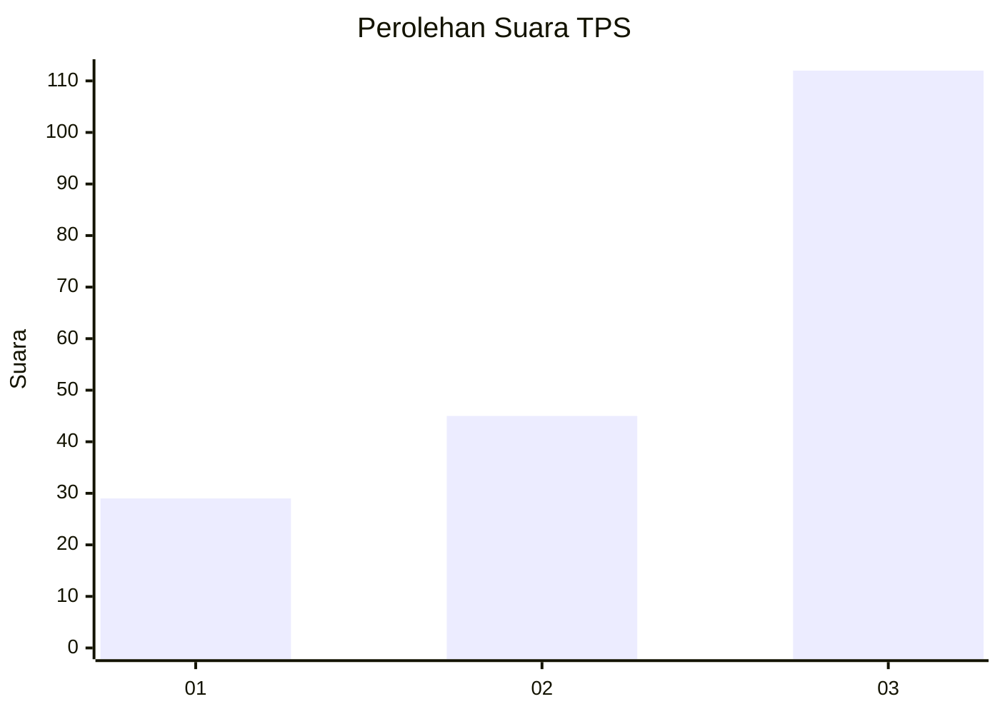
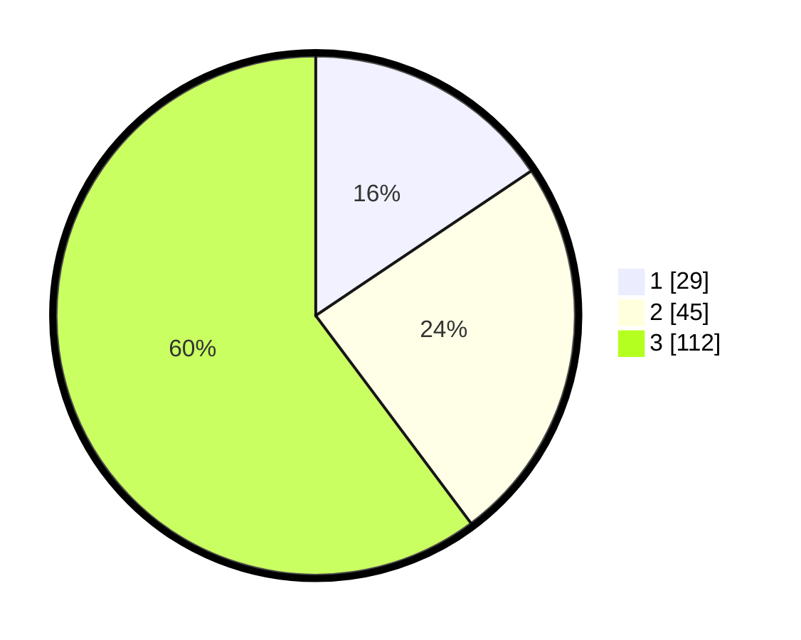

# Hasil

## Grafik

## Tabel

| No. | Nama Paslon    | Suara | Suara (raw) | Persentase |
|:--- |:-------------- | -----:| -----------:| ----------:|
| 1   | ANIES MUHAIMIN | 29    | [29][p-1]   | 15,59      |
| 2   | PRABOWO GIBRAN | 45    | [45][p-2]   | 24,19      |
| 3   | GANJAR MAHFUD  | 112   | [112][p-3]  | 60,22      |

[p-1]: https://github.com/gigit-pemilu/pemilu-2024-92-papua-barat/blob/main/pilpres/hitung-suara/sub/92-papua-barat/sub/11-manokwari-selatan/sub/05-momi-waren/sub/2006-demini/sub/002-tps/sub/paslon-1.txt
[p-2]: https://github.com/gigit-pemilu/pemilu-2024-92-papua-barat/blob/main/pilpres/hitung-suara/sub/92-papua-barat/sub/11-manokwari-selatan/sub/05-momi-waren/sub/2006-demini/sub/002-tps/sub/paslon-2.txt
[p-3]: https://github.com/gigit-pemilu/pemilu-2024-92-papua-barat/blob/main/pilpres/hitung-suara/sub/92-papua-barat/sub/11-manokwari-selatan/sub/05-momi-waren/sub/2006-demini/sub/002-tps/sub/paslon-3.txt

## Foto C Plano

https://sirekap-obj-formc.kpu.go.id/7699/pemilu/ppwp/92/11/05/20/06/9211052006002-20240215-163139--b006a329-93d2-4b38-9121-b6a62b1f033c.jpg

https://sirekap-obj-formc.kpu.go.id/7699/pemilu/ppwp/92/11/05/20/06/9211052006002-20240215-163157--85ee5444-44e0-4720-a1e7-da0753e571d8.jpg

https://sirekap-obj-formc.kpu.go.id/7699/pemilu/ppwp/92/11/05/20/06/9211052006002-20240215-163231--179a3290-c813-49d6-b1e2-fb18da205720.jpg

## Metadata

| Key        | Value               |
| ---------- | ------------------- |
| Time Stamp | 2024-02-25 12:00:00 |

